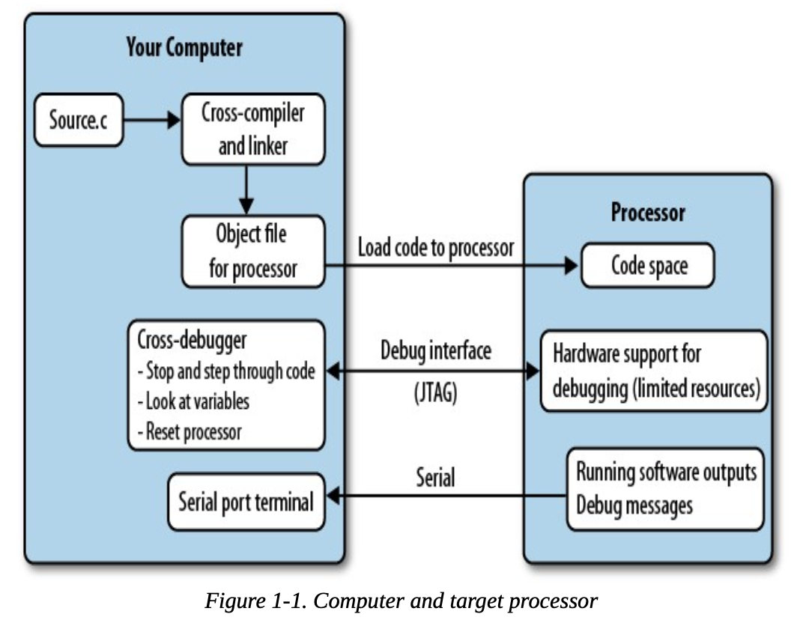

# Chapter 1. Introduction

## What are embedded systems?

- Embedded systems are a computerized system that is purpose-built for its application.

## What kind of constrains do you face with embedded systems?

- CPUs probably run more slowly to save battery power.
- Some systems require that the softwaer is fault-tolerant with graceful degradation in the face of error.
    - Unlike other software, you need to handle cases where hardware becames faulty.

## Cross Compilers

- Embedded systems use a cross compiler.
    - A cross compiler generates a binary that runs on your target system.
- Most embedded software only supports C, or C++.
    - Embedded C++ is more constrained, only implementing a subset of the language.

## Debugging

- If you debug software on a computer, you can compile and debug on the computer.
    - Your system has enough resources to run the program and support debugging at the same time.
- Embedded systems, in addition to a cross-compiler, requires a cross-debugger.
    - A debugger sits on your computer and communicates with the target processor through special processor interface.
        - This interface is known as JTAG
- Debugging is resource intensive.
    - For example, the debugger needs to halt as it runs and provide debugging info.

## JTAG

- JTAG is a debugging interface used to "eavesdrop" on your Process as it works.

## How do debuggers debug?

- In memory loaded code, the debugger will modify the code to say "stop".
- If it's in flash memory, the process sets an internal register, continue to run until the Program Counter == the address in the internal register.

## What device communicates between your PC and processor?

- Hardware debugger
- programmer
- debug probe
- In circuit emulator
- JTAG adapter.

## Resource Constrains

- Since embedded systems are designed to perform specific tasks, it's important to cut out resources that it doesn't need. This includes:
    - RAM
    - ROM/flash
    - Processor speed
    - power consumption
    - Processor Peripheral.

- These are exchangable. For example, you can write code that uses up more space, but runs more quickly.

