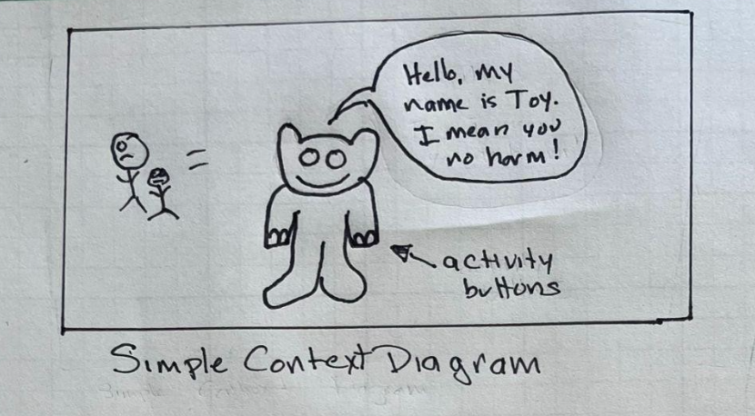
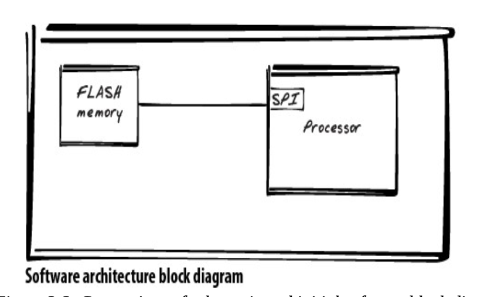
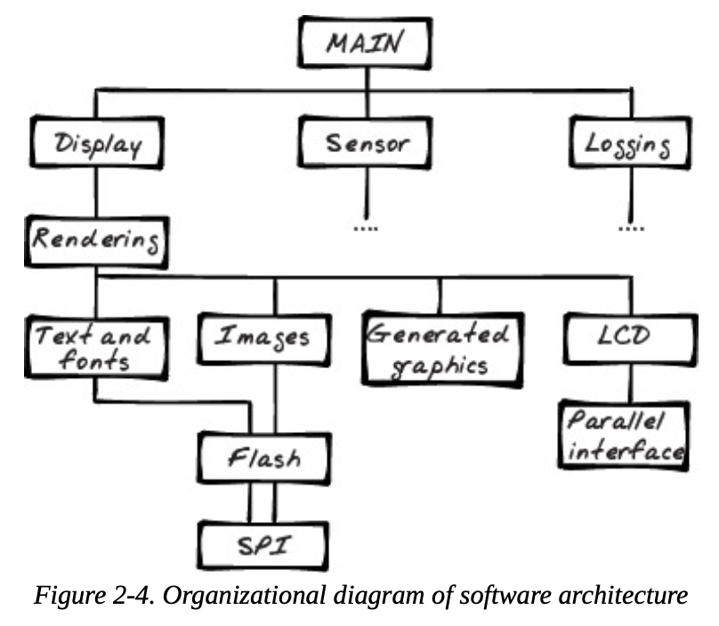
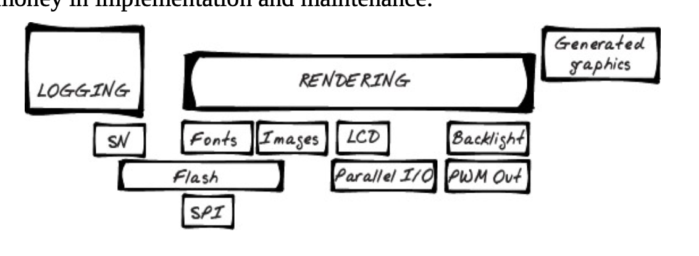
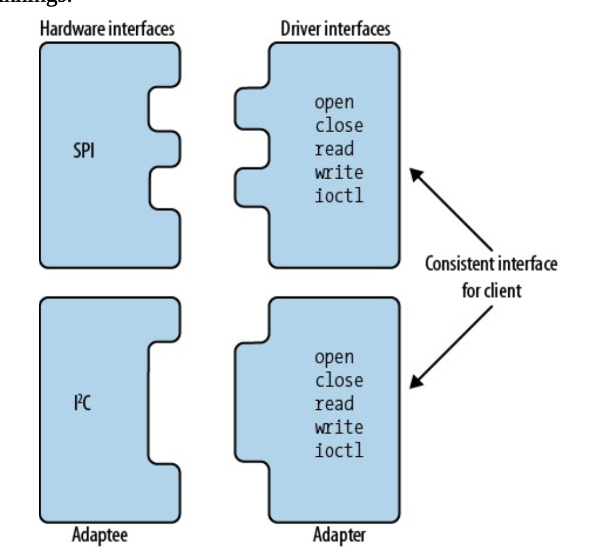

# Chapter 2. Creating a System Architecture

## Systems Diagrams

- Hardware designers make schematics
- Software developers make Diagrams to show the relationship between various parts of the software.

## Four types of systems diagrams

- Context Diagrams
- Block Diagrams
- Organigram
- Layer diagram

## Context Diagram

- This diagram is an overview of how your systems fits into the world.

- This simply describes what the device does.

## Block Diagram

- A block diagram represents both a model of the hardware and software elements.
    - Each chip attached to a processor is an object.

- It gives us an idea about what to keep and separate.

## Organigram

- Organigram are organizational charts.
- It's similar to block diagrams, but more hierarchial.

## Layering Diagrams

- You draw boxes, varying the size based on it's complexity. 
- Afterwards, add items that use the lowest layer, and the users touch the lower level object.

## Adapter pattern

- One software design pattern is called adapter (or wrappers)
    - These abstract teh interface of an object to make it easier for a client to use.
    - Also good if the low level interfaces change, you don't need to change the client code.

## Versioning your code

- You should send the version number via USB, WiFi, UART or some other protocol call.

- A good convention is the form of A.B.C where:
    - A denotes a major revision (1 byte)
    - B denotes a minor revision (1 byte)
    - C is a build indicator (2 bytes).;

### MVC Pattern

- This is a software pattern used to segregate the different algorithms.

- MVC stands for:
    - Model: Takes raw data, turns it into something useful.
    - View: Create the form of the output. Makes in "stunning" (if you have a system that sends data over a network for example.)
    - Controller: Coordinates the model and view.