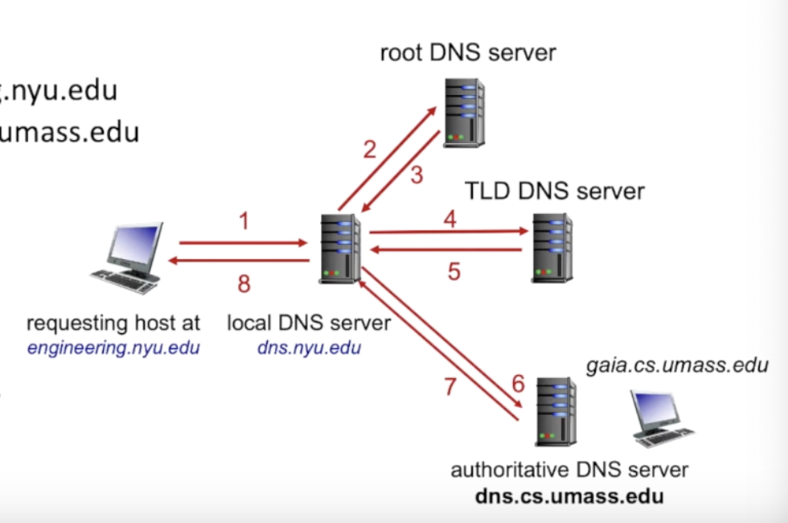
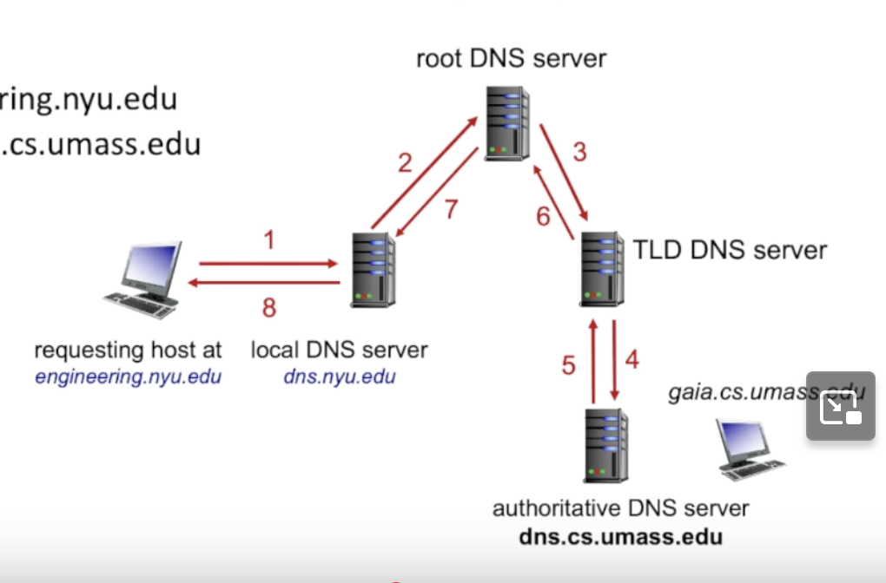
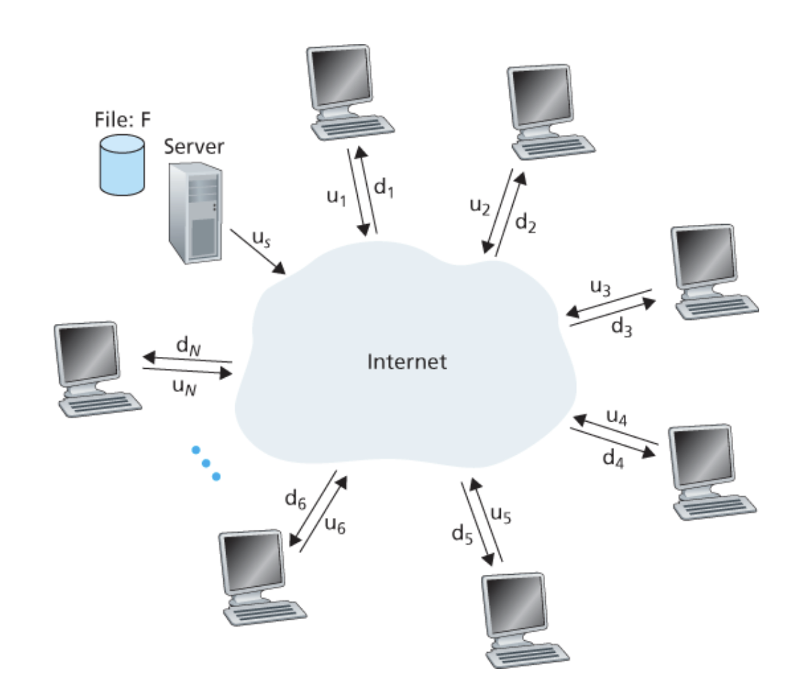
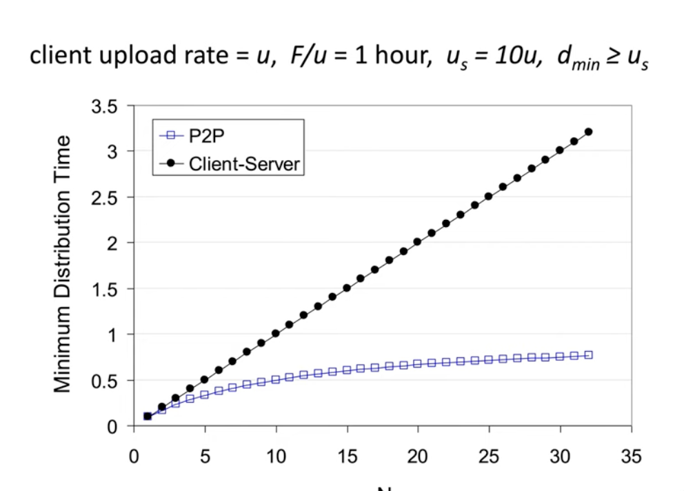
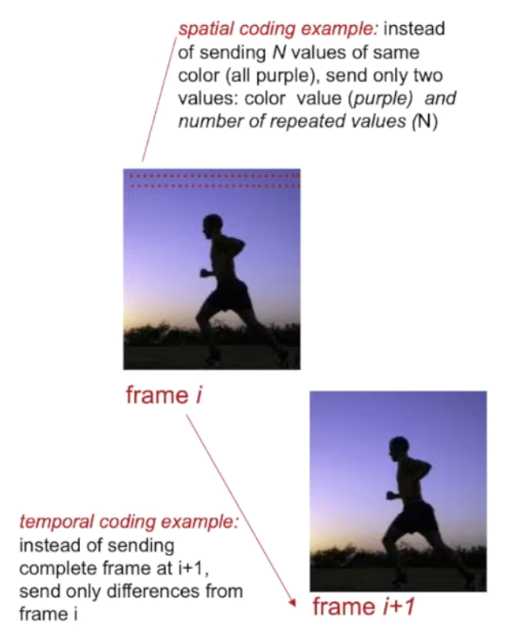
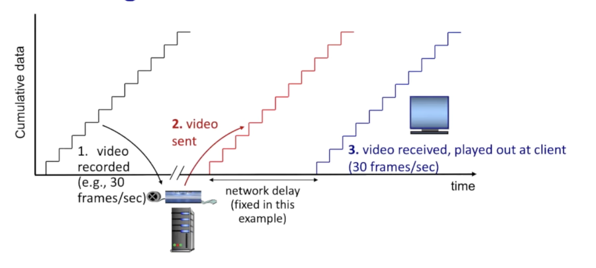
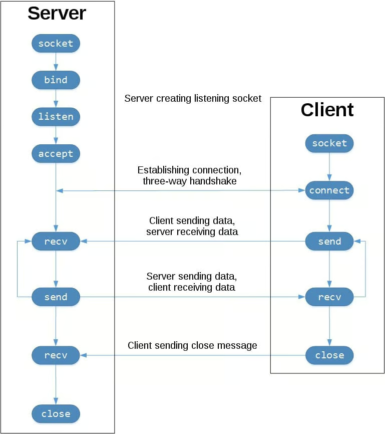

# Chapter 2

## Client-Server Paradigm

- Here, a server:
    - Provides services
    - Has a permanent IP address
    - Always on host
    - Often in data centers.
- Clients:
    - communicate with services
    - May be intermittenly connected
    - Won't have permanent IP address
    - Clients don't interact with eachother, they communicate through servers

- Example: HTTP, IMAP, FTP

## Peer to Peer Architecture

- There's no server
- Peers directly communicate to eachother.
    - Peers exchange data between other peers

- Example: P2P File Sharing

## Process Communicating, Interprocess communication, messages

- Process: Program running within a host. 
- Inter process communication is when, within the same host, two processes communicate. 
- Processes in different hosts communicate by exchanging messages.

## What are clients and server processes?

- Client processes initiate communication
- Server Processes wait to be contacted by a client.

## Sockets

- Sockets is an abstraction where processes can send and receive messages from eachother.
    - Socket is analogous to doors.


- Sending processes send messages
- the receiving process receives messages with the receiving processes' socket.
- Here, we have two sockets involved.

## Addessing processes

- We need to somehow uniquely identify processes
- host devices usually have a unique 32 bit IP address.

- Identifiers include IP Addresses and Port numbers.
    - port numbers let you host many things on one IP address.

## What does a protocol define

- Type of messages exchanged - format of messages
- Message syntax - what fields are in the messages.
- Message symantics - what do the fields in the messages mean?
- rules - when and how processes send and respond to messages

## Open vs Proprietary protocols

- Open protocols are available to the public.
    - Example: HTTP, SMTP
- Proprietary protocols:
    - Example: Skype, Zoom


## What transport services does an app need?

- Data Integrity:
    - Some apps require 100% reliable data transfer
    - Others are okay.
- Timing
    - Some apps may need low delay
- Throughput:
    - should the app minimize or maximize throughput.
- Security:
    - Encryption, data integrity. 


## Internet Transport Protocol Services

- There are two Transport Protocols: UDP and TCP.

- TCP:
    - reliable transport between sending and receiving processes.
    - flow control: sender won't overwhelm receiver.
    - congestion control: Throttle sender when network overloaded.
    - Connection-oriented: Setup Required between client and server processes.
    -  Doesn't provide timing, minimum throughput guarantee, security.
- UDP
    - Unreliable data transfer: no guarantees made.
    - Doesn't provide: Reliability, flow control, congestion control, timing, throughput guarantee, security or connect setup. 

## Why use UDP?

- It's more bear bones, so we can add in features we want. 

## What is a webpage?

- Web pages consist of objects, each of which is stored on different web servers
    - These objects can be HTML files, JPEG, etc.
- Web page consists of base HTML-files which several referenced objects, which we address with URLs

```
www.someschool.edu/someDept/pic.gif
```
- `www.someschool.edu/` is the hostname
- `someDept/pic.gif/` is the path.

## HTTP Overview

- HTTP: Hypertext transfer protocol
- This is the Web's application layer protocol
- It follows the Client/Server model.
    - Client: can be web browser
    - Server: web server that sends web pages.

- HTTP uses TCP
- HTTP is "stateless"
    - this means the server maintains no information about past client requests. 

## How does an HTTP connection work?

- The client initiates a TCP connection to server, port 80.
- The server accepts the TCP connect from client.
- HTTP messages exchanged between browser and web server.
- TCP connection closed.

## Types of HTTP Connections. Differences between the two. 

- There are two types of http connections:
    - Non-Persistent HTTP:
        - Opens TCP Connection
        - Sends one object over connection
        - Closes connection
    - Persistent HTTP:
        - TCP Connections opened to server.
        - We can send **multiple** objects over a single TCP connection
        - TCP connection closed

- Non-persistent HTTP requires us to make multiple TCP connections for multiple objects. 

## RTT Metric

- RTT is the Round Trip time, which defines the amount of time it takes for a packet to travel from the client to a server and back. 


## Persistent HTTP

- Here, the client:
    - opens up a TCP connection with the server
    - the server sends data to the client as needed 
    - The connection doesn't close until the client stops requesting from it for a certain ammount of time. 


## HTTP Messages

- There are two types of HTTP Messages: request and response.
- The request line starts with `GET /index.html HTTP/1.1\r\n`
    - `GET` is a method name.
    - `/index.html` is the html file requested.
    - `HTTP/1.1\r\n` is the version of HTTP, and a new line. 
- The next line are header lines, which has some stuff.


- The response messages starts with a line like `HTTP/1.1 200 OK`
    - `HTTP/1.1` is the version number of the HTTP.
    - `200` is the status code.
    - `OK` is the short status phrase.
    - There are header lines, then the actual content itself.

## HTTP REQUEST Messages

- POST method: User input sent from client to server.
- GET method: Includes user data in URL field of HTTP GET message.
- PUT method: Upload file(Object) to server.
- HEAD method: asks for response similar to get request, but without entity body.

## HTTP Response status codes

- 200: OK
- 301: Moved permanently.
    - The object you requested is somewhere else, specified in the message.
- 400: Bad Request
    - Request message not understood by server
- 404: Not found
    - Requested document not found on server.
- 505: HTTP Version not supported.

## Cookies

- Web sites use cookies to maintain information about a user's browser between transactions.

- Four components of using a cookie:
    - Cookie header line of HTTP response
    - The cookie header line in next HTTP
    - Cookie file kept on user's host managed by users browser.
    back end data at website. 

- Cookies help you with authorization, shopping carts, recommendations, etc.

## Email

- The Email has three major components
    - User agent
    - Mail servers
    - SMTP: Simple mail transfer protocol.


## Email - User Agent

- This is what you use to edit, compose, and send messages
    - Example: gmail, outlook
- Messages are stored on the server

## Email - Mail Servers

- There are two sets of messages for each user:
    - Mailbox: contains incoming messages for users
    - Messaging queue: Contains outgoing mail messages.

## Email - SMTP protocol

- Protocol thet sends email messages between email servers
    - The client is the sending mail server
    - THe server is the receiving mail server.

- SMTP uses TCP to send email messages
    - It uses ports 25.


## Phases of SMTP TRansfer

- There are three phases:
    - SMTP handshaking
        - exchanges 3 messages
    - SMTP transfer of connections
    - SMTP closure.


## Mail Message format

- There are two main parts of a mail message:
    - header line: Contains the to, from and subject of email.
    - THe Body is the message itself. 

## IMAP protocol

- The Internet Mail Access Protocol.
    - This handles retrieval, deletion, folders of stored messages.

## DNS

- DNS is short for **Domain Name System**

- We learned that internet hosts and routers have unique:
    - IP Addresses
    - Names

- DNS let's us map between IP Addresses and names

- DNS contains information about names and ip address translations.
    - The DNS is a heirarchy of databases.
- The DNS is implemented as an application layer protocol. 

## DNS Services

- DNS Services provide:
    - host_name to IP translations.
    - Host aliasing: translating external names to internal names.
    - returning IP address of mail server associated with domain
    - Load distribution.
        - Many IP addresses correspond to one name. 

## Centralized DNS

- Centralized DNS means there's only one server where all people would translate hostnames to IP addresses, introducing flaws:
    - Single point of failure
    - Traffic valume
    - Maintenance headache. 

## Heirachial DNS


- It's nice to be heirachial, more organized. 

## Iterative vs. Recursive DNS queries

- Iterative Queries put a lighter load on servers



- Recursive queries will go depth first, has heavier load on servers, less common. 



## DNS Resource Records

- DNS database records have a:
    - Name.
    - Value
    - type
    - ttl

- Type=A (address record)
    - Contains hostname and ip address
    - Value is the ip address
- Type=NS (name server record)
    - Name is the domain
    - value is the hostname of authoritative name server for this domain.
- type = CNAME
    - Like an alias for the real name.

- type = MX
    - Value is the name of SMTP mail server associated with name.

## Peer to Peer Architecture

- These architectures don't rely on servers, instead communicating with each other.
    - Peers request services to other peers.
    - It's important for peer to peer applications to scale up, proportionally to the requests. 

- Examples include P2P file sharing (BitTorrent), streaming, etc.


## P2P Scalability, Distribution time

- The objective of P2P is to share files between peers.



- The Distribution time is the time it takes to distribute a file to all N peers.
    - This also means the server would need to transmit NF bits.
    - Since the upload rate of the server is $u_s$, the time to distribute the file is NF/$u_s$.

## Time to distribute with client server vs. P2P

- Time to distribute F to N clients using Client-server approach:
    - $D_{c-s} \geq max\{NF/u_s ,F/d_{min}\}$
        - One of these will be a bottleneck.
        - The download time increases linearly.

- The time to distribute using P2P:
    - $D_{P2P} > max\{F/u_s , F/d_{min} , NF/(u_s + \sum u_i)\}$
        - $F/u_s$ is the ammount of time it takes for the server to send a copy.
        - $F/d_{min}$ is the time it takes for the min client to download the file.
        - Client max upload rate: $u_s + \sum u_i$



- P2P scales better compared to using the client server model.

## What are videos and images

- Videos are a sequence of images displayed at a constant rate.
- digital images are an array of pixels each pixel represents with bits.
    - These pixels are encoded to reduce the size of image, and video as a result. 
        - It reduces repetition.

## Video Encoding methods

- There are two video encoding methods:
    - CBR (Constant bit rate)
        - Video record rate is fixed over time
    - VBR: Video encoding rate changes as ammount of spatial and temporal coding changes.

## Spatial coding vs temporal coding



## Streaming video



- Here, we can see that the server sends the video to the client.
- Something interesting, you can see that the client starts watching the video while the server is still sending data.
    - This is known as **streaming**, we don't send the whole video for the user, but it chunks, as they go. e

## Streaming Multimedia: DASH

- DASH: **D**ynamic, **A**daptive **S**treaming over **H**TTP
    - Addresses issues with inadequate bandwidth between the client and server.
- DASH:
    - Server:
        - Divides video files into multiple chunks
        - Store each chunk encoded at multiple different rates.
        - Different rate encodings are gonna be stored in different files.
        - Files are replicated in various CDN nodes
        - manifest file: tell clients to pick up some chunk at a particular point in time.
    - Client:
        - estimates server to client bandwidth.
        - consult manifest, request chunks one chunk at a timme.
            - Choosing the maximum coding rate sustainable.
    
## Content Distribution Networks

- We need to somehow stream content to hundreds and thousands of simultaneous users.
- Content Distribution Networks will store/serve multiple copies of videos at multiple geographically distributed sites (CDN).

- There are two approaches to CDN: 
    - Enter Deep: Push CDN servers deep into many access networks.
    - Bring home: smaller number of big clusters in Points of presence near access nets. 

## Manifest files

- Manifest files tell you where to find video chunks.
- If you send a request to netflix for example, they'll send a manifest, which tells you where video chunks are.


## Sockets

- The socket is the door between the application and transport layer.

- The Socket offers two transport services:
    - UDP: Unreliable datagram.
    - TCP: Reliable, byte stream-oriented.

## UDP Socket Interface

- In UDP, there's no "connection" between the client and server
    - there's no handshaking here
- The sender needs to explicitly send the IP address and port number in each packet.
- The receiver will extract the sender IP address and port nmuber from the received packet.
- In UDP, transmitted data maybe lost, or received out-of-order.

## How do you create a UDP socket is python

```py
serverSocket = socket(AF_INET,SOCK_DGRAM)
```
- `AF_INET` is an internet type socket. 
    - This tells us that the socket uses IPv4
- `SOCK_DGRAM` tells us it's a UDP data gram. 

## How do we connect a socket to a server/port number

```py
    socket = socket(socket.AF_INET,socket.SOCK_DGRAM)
    socket.connect((host_ip,port)) # this binds the ip and port to the socket
```

## TCP Sockets

- Unlike UDP, Client needs to contact the server first.

- The client contacts the server by:
    - Creating the TCP socket, specifying the IP address and port number of the server process.
    - When the client creates the socket, the client TCP establishes a connect to the server TCP. 

- When servers are contacted by the client, the server will create a new socket under TCP for server processes to communicate with that particular client.

- TCP provides reliable, in order byte stream transfer between the client and server process.

## What does a TCP Client/Server Socket interraction look like?


