# Chapter 3

## What is the Transport layer?

- The transport layer provides **logical communication** between application process running on different hosts.
- The transport protocol works in the end systems.
- There are two protocols: UDP and TCP
- The transport layer is the logical communication between processes.
    - The layers below do the actual transportation.

## What is logical communication?

- From the transport view, two devices are logically connected, despite being separated by routers, links, etc.
    - The medium through which they're connected may lose, flip bits or affect order.
        - Under logical communication, we ignore these mishaps.

## How does the network layer differ from the transport layer?

- The transport layer communicates through a logical connection.
- The network layer provides the logical connection the transport layer uses.

## Why do we need multiplexing/demultiplexing?

- We use these, because, multiple processes can have sockets.
    - Or a single process can have multiple sockets.
- When the transport layer receives the data from a server, how can it give the data to the correct process or socket?
    - All sockets don't directly deliver data, but goes through an intermediary socket.

## What is demultiplexing, how does it work?

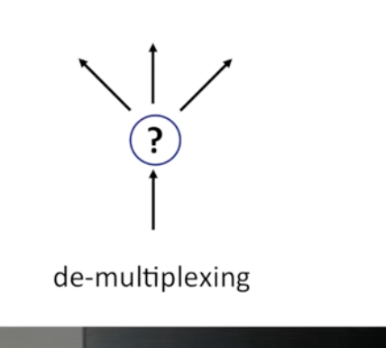

## What is multiplexing?

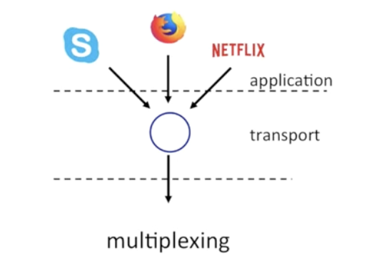

## What does demultiplexing solve for us?

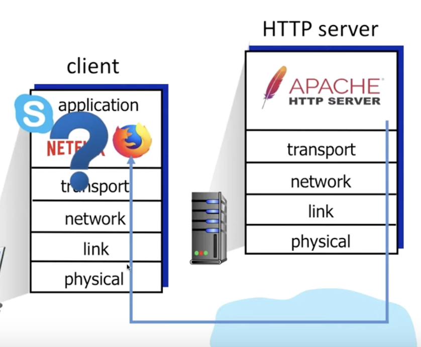

- We'll have many clients that use the transport layer. When we receive data from the HTTP server, how do we know which application the data belongs to?
- Another example, when we send a request to an HTTP server, which process should handle it?

## How does demultiplexing tell sockets apart?

- When a host receives an IP datagrams:
    - each datagram has a source IP and destination IP address
    - each datagram carries a transport layer segment
        - This has two interesting fields:
            - Source port number
            - Destination port number.

- The host will use the IP address and port number to direct segments to the appropriate socket.

## How does UDP handle demultiplexing?

- when we create a socket, we specify a host-local port number:

```rs
DatagramSocket sock = new Datagram(12534)
```

- When creating a datagram sent into socket, we need to specify the:
    - Destination IP Address
    - Destination Port number

- One the receiving end:
    - When the destination port number in the segment.
    - direct UDP segment to the socket with the port number.

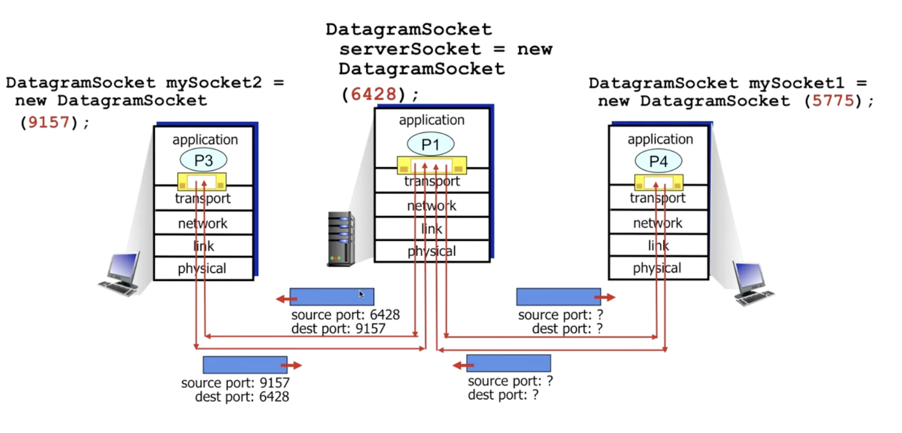

## How does TCP do demultiplexing?

- TCP sockets are identified by a 4-tuple:
    - source IP address
    - source PORT number
    - dest IP address
    - dest PORT Number

- the demux will use all four values to direct a segment to the appropriate socket.

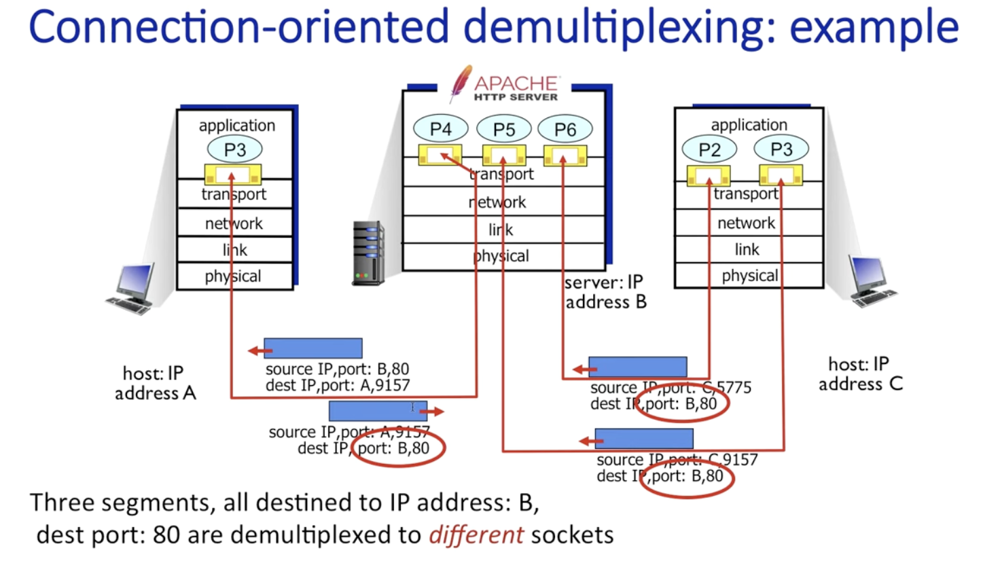

- despite having the same port number, it differentiates it from the client ip and port number.

## What happens when you send a packet with UDP

- Application layer sends packet.
- Form a UDP segment filling out certain header field values.
- Creates UDP segment
- Gets sent to IP, which sends the packet to the other end.

- At the other end, it:
    - receives the message
    - check integrity of data
    - demultiplex the data to the correct socket.

## What's in the UDP Segment header

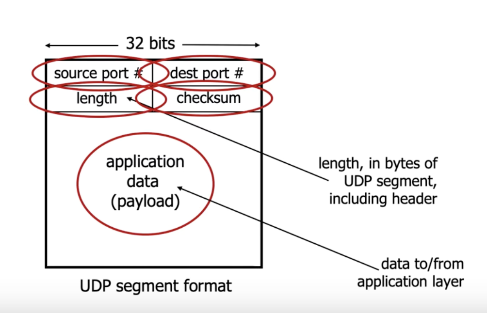

## What's a UDP checksum

- A checksum detects errors in transmitted segments.
    - Does the sum of two numbers receive = the number specified in check sum.
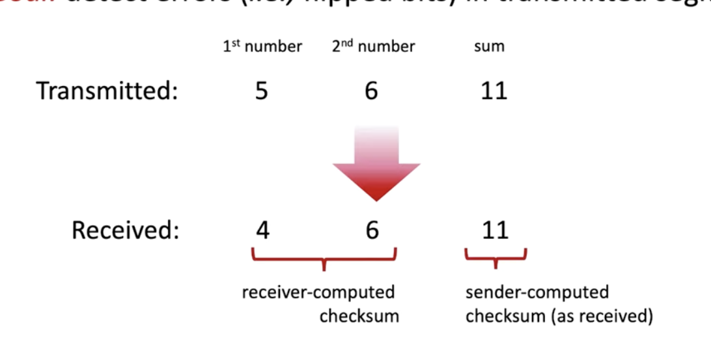

## Reliable data transfer - implementation idea, design considerations
- We want to be able to send packets that aren't corrupted, or lost.

- We ideally want to be able to send data reliably between two ends. We generalize the implementation, assuming there's a unreliable channel we need to develop on:

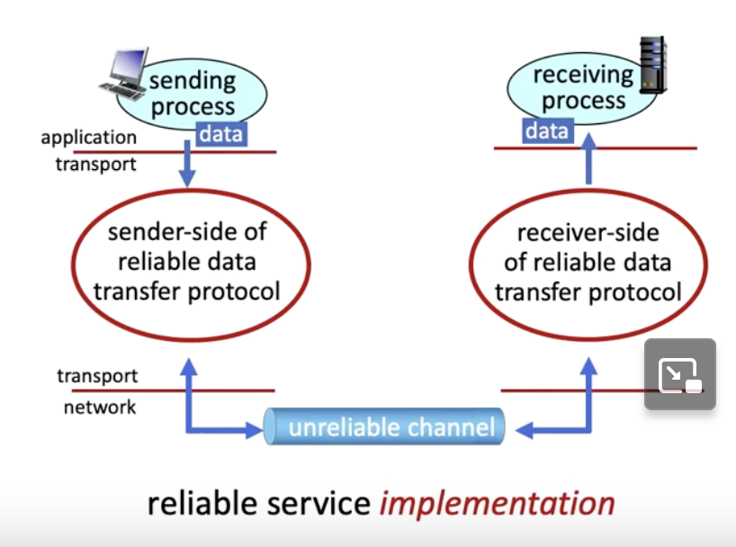

- We need to consider the following:
    - Send and receiver don't know the state of eachother.
    - The complexity of implementing a reliable data transfer protocol depends on the characteristics of an unreliable channel.

## Where can packets get corrupt or lost?

- In the network.
- At the receiver.

## Flow Control

- Flow control is the process of managing the rate of data transmission between two nodes to prevent a fast sender from overwhelming a slow receiver.

## Flow Control - Ideal network

- Ideally, we have error free transmission links and an infinite queue buffer at the receiver.

## Flow Control - stop and wait

- We send a packet to the receiver. When they get it, they should send us an ACK
    - which tells us the packet arrived successfully and we can send the next packet
- If the packet doesn't arrive, the receiver won't send an ACK. 
    - We have a timeout, so it the RTT exceeds the timeout, we try to resend our message.


- Stop and wait is effective, but not very efficient:
    - only one data frame can be in transmit at a time.
    - When waiting for an acknowledgement, the sender can't transmit any frames.

## Sliding Window protocol

- Here, we can send multiple frames at a time.
    - The number of frames depends on a parameter: **window size**.
    - Each frame is numbered, called a sequence number.

- The window size tells us how many bits we're allowed to send before an acknowledgement.

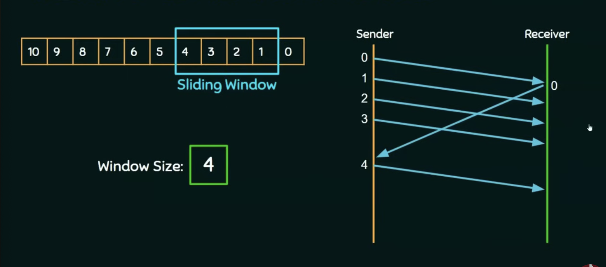

- You can see, we only send new frames once we get an ACK

## Go-Back-N ARQ

- Go - Back - N ARQ using the concept of protocol pipelining.
    - The sender can send multiple frames before receiving the acknowledgement for the first frame.
- There are a finite number of frames and numbered in a sequential manner.
- The number of frames that can be sent depends on the window size of the sender.
- If the acknowledgement of a fram isn't received within an agreed upon time period, all frames in the current window are transmitted.
- N is the sender window size.

## Selective Repeat

- Only the erroneous or lost frames are retransmitted.
- The receiver will keep track of sequence numbers.
    - If any sequence numbers are missing, the receiver will send NACK (not acknowledge) only for frames that are missing or damaged.
- AKA, we don't need to send all the frames in the window, just send the not acknowledged ones.

## TCP Connnection Establishment

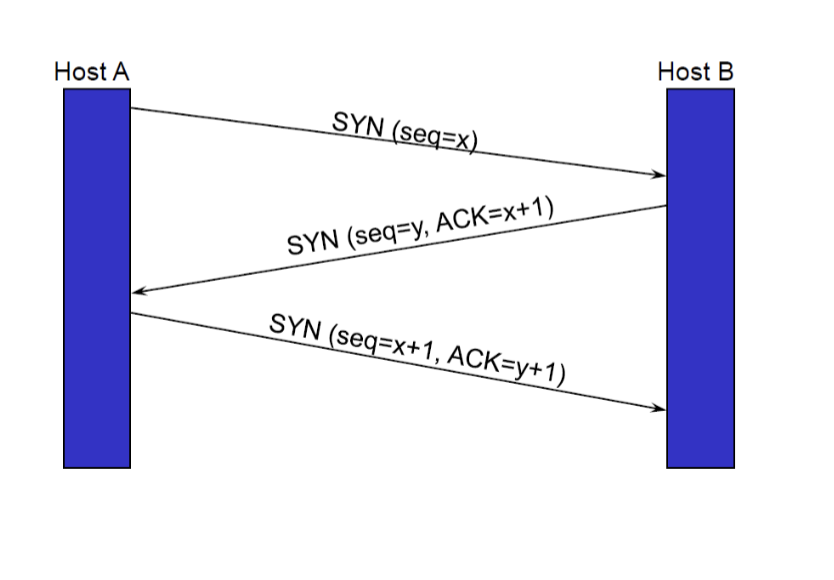

- First, the client sends a SYN segment to the server, asking to connect
- Second, the server responds with a SYN ACK, which means the client should open a connection
- Finally, the client sends an ACK, finishing the handshake.

## TCP Connection Tear-down

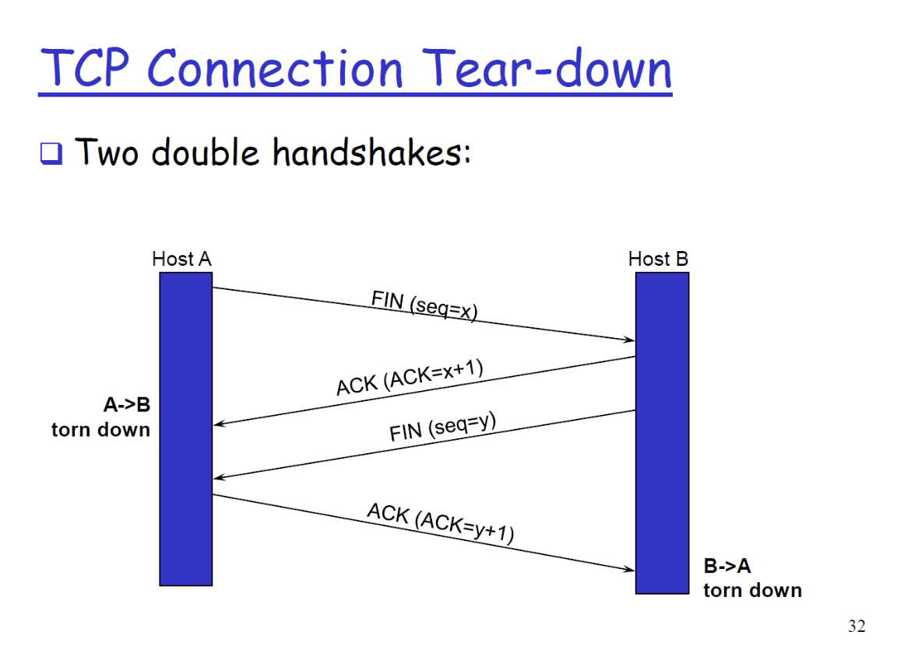
- Host A sends a FIN segment to host B
    - This indicates host A has no more data to send.
- Host B acknowledges the FIN segment by sending an acknowledgement with a sequence number x + 1.
    - Now, the connection from A -> B is closed.
- Host B sends a FIN segment to host A
- Host A sends a ACK to B
    - Now the connection from B -> A is closed.

## RTT

- RTT is the round trip time:
    - This metric defines how long it takes for the packet to arrive at the destination, and to receive an acknowledgement from the destination.

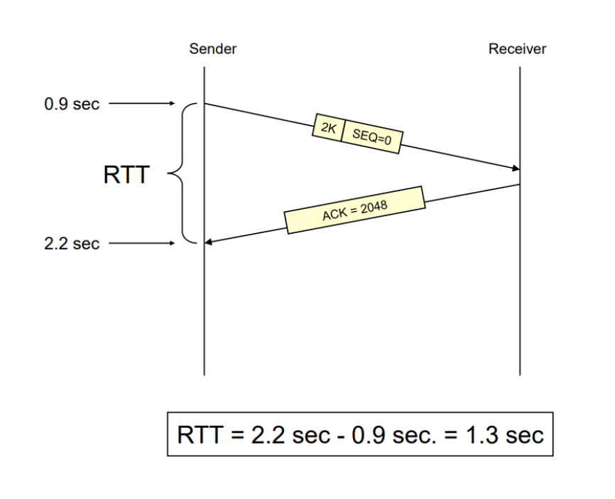

## Smoothed ronud trip time

- We should smooth out the RTT due to variations of delay within the networks:

$SRTT = \alpha SRTT + (1 - \alpha) RTT$

- Alpha is a constant, usually equal to 0.875

## Timout value

- We calculate the Timeout by multiplying RTT by some factor beta.

## Calculate the following 


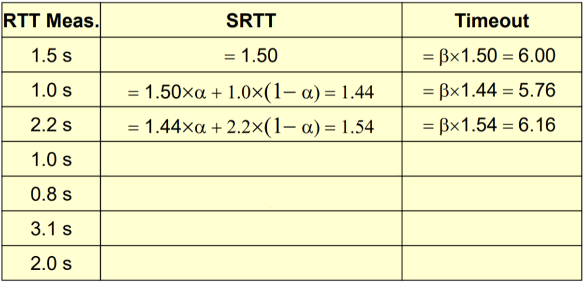


## TCP Flow Control

- TCP uses a modified version of the sliding window.
- TCP transports bytes instead of packets.