# Chapter 4

## What is the network layer?

- The network layer will encapsulate a transport packet into a datagram and pass it to the link layer.
    - Among the hosts and servers:
        - The send does the encapsulation
        - The receiver delivers the segment to the transport layer protocol
    - Among routers:
        - receives data grams and forwards it to the appropriate output link.


## Two key network layer functions

- We need to consider local and global considerations
    - Local: Decision or action made at the individual router
    - Global: end to end or network wide.

- We break our network layer into the local and global functions.

- the two main functions includes:
    - forwarding: move packet from router's input link to appropriate router output link (local function)
        - Known as data plane
    - Routing: determine the route the packet takes from the source to destination.
        - These are routing algorithms.
        - Known as control plane


## Two control plane approaches

- Traditional routing algorithms (dijkstra, etc.)
    - Treat the router as a huge graph.
- Software defined networking.
    - Here, the routers contact a remote controller (dataserver), which will tell the router where to go.

## How do routers know where to send datagram

- Routers have a forwarding table, which, based on the header, will determine which output link to travel to. 

### How do we actually fill these tables?

- It can be done by hand, which was how it was done initially.
    - Nowadays, there are way too many tables out there, so they're computed, using either a traditional routing approach or a software defined networking approach.


## Network service model

- The network layer may:
    - guarantee delivery (maybe within some time constraint).
    - guaranteed minimum band width.

- In reality, The network follows the "Best effort" service
    - THis means that it can't guarantee a sucessful bandwidth delivery, timing, etc.


## Router Architecture

- Routers consist of:
    - input ports
    - high speed switching fabric (the routing logic)
        - also has a routing processor, which installs forwarding tables, and does routing logic
    - output ports.

### Input port

- The input port consist of three elements:
    - line termination (physical layer)
    - link layer protocol (link layer)
    - lookup, forwarding queue (handles datagrams arriving faster than the forwarding rate)

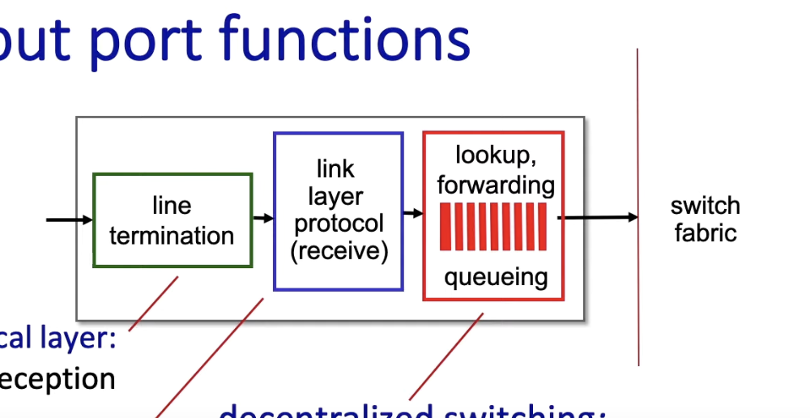

## Destination based forwarding

- It's a way of implementing a forwarding table
    - We determine the output link based on the destination address range (aka, we look at the lower bits.).

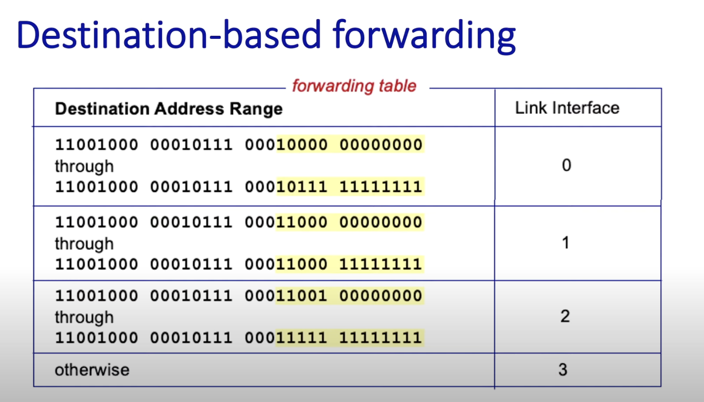

- This works decently, but it's doesn't allow for flexibility. Instead, longest prefix matching is preferred.


## Longest Prefix matching

- Another way to implement a forwarding table, but we look at the most significant bits. 
    - These bits change much less.

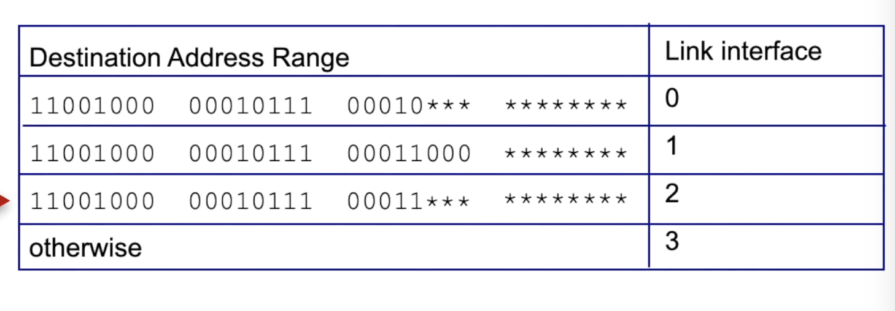

## Switching fabric, switching rate, switching approach

- The heart of the router.
    - It's job is to move a packet from the input port to it's output port.

- We measure a **switching rate**, which is the rate where packets can be transferred from inputs to outputs.

### 3 switching fabric approaches

- There are three ways of implementing the switching fabric:
    - memory
    - bus
    - interconnection network

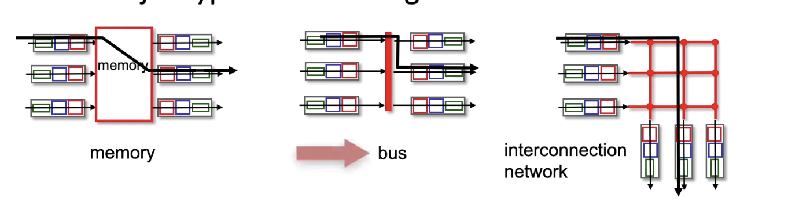


## Input port Queuing, HOL, 

- If the rate at which packets arrive then the rate the switching fabric can move the packets to it's destination, we'll need to queue to the input.


### Head of Line Blocking

- This occurs where multiple packets at the input ports want to go to the same output port.

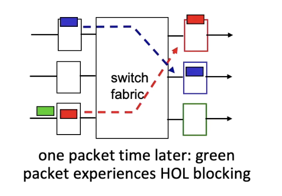

- Here, the green packet is experiencing HOL blocking.

## Output port queuing

- We need a buffer when the switching rate (from the fabric) is faster than the link transmission rate.
    - We have a buffer to hold the packets. If it gets full, we drop em.


## Buffer size?

- We don't want too big of a buffer, as it'll cause an increase in delays.
    - Long RTT, bad for real time apps, sluggish TCP responses.

- The ideal size is the typical RTT times the link capacity C / sqrt of N flows.
    - (RTT * C) / sqrt(N)


## Buffer Management mechanism

- For now, lets think of the output port of a router as a queuing system.

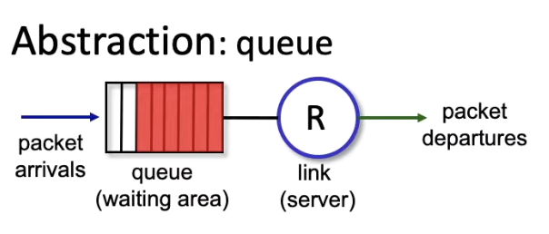

- We drop packets when the buffer is full, what what do we drop?
    - tail drop: We drop packets that arrive while the queue is full
    - Priority: Drop packets (including ones in the queue) based on a priority.
- we can also mark with a congestion link to indicate there's congestion.


## Packet Scheduling

- This decides which packets to send to the output port.
    - Think OS CPU Schedulers.
- Packet schedulers include:
    - first come, first serve
    - priority
    - round robin
    - weighted fair queuing

## Packet Scheduling: FCFS

- Here, we send packets based on who arrives first.

## Packet scheduling: Priority

- Here, we classify traffic by classes
    - Similar to airline classes
- We prioritize high level classes. 


### How do we determine the priority?

- This is determined by the ISP.
    - voice packets get higher priority than email, for example.
    - Netflix may have a higher priority

- Another way is based on the source/dest addresses.

- Some companies can also pay for high priorities.


## Round Robin Packet Scheduling

- Similar to priority scheduling, but we we classify the packets cyclically
    - classify packet 0 as class 0, classify packet 1 as class 1, classify packet 2 as class 2, clasiffy packet three as class 0, etc.


## Weighted Fair Scheduling - Packet Scheduler

- Here, we calculate the weight of each queue, and priority one of them (**clarify this**)

## IP Datagram format

- The IP datagram consists of the following:
    - IP protocol version.
    - Header length (tells IP where payload begins).
    - length of the datagram (header + payload)
    - type of service bits
    - TTL (time to live), each router hop, it's decremented
        - It's dorpped if this becomes 0. Prevents cycles.
    - upper layer protocol (TCP or UDP)
    - a checksum.

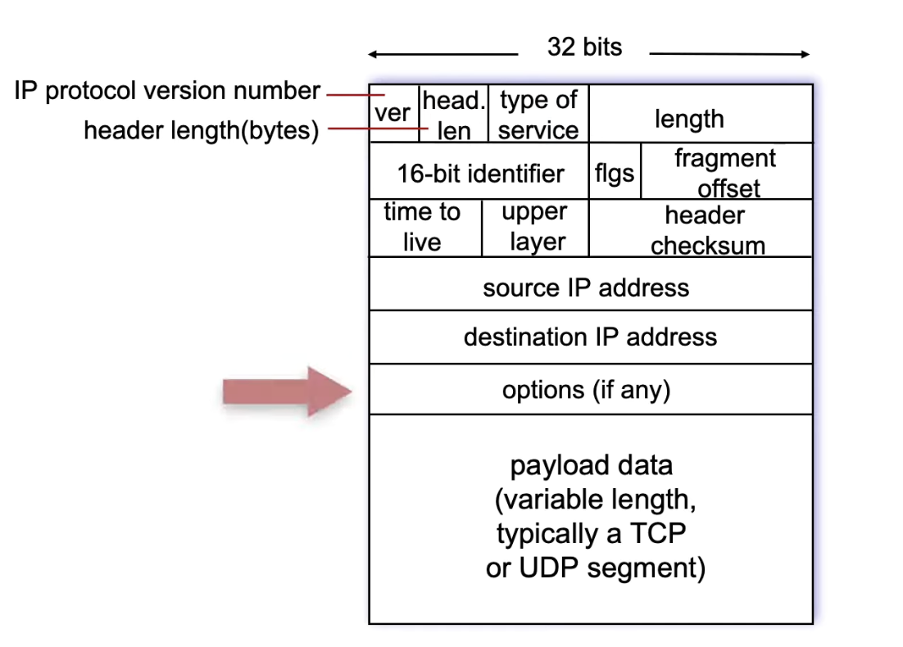

- FYI, this is for IPv4

## IP Address intro

- The IP doesn't identify a host, but a router interface.
- Interfaces are connections between host/router and physical link.
- Host will typically have one or two interfaces (Ethernet, wireless)

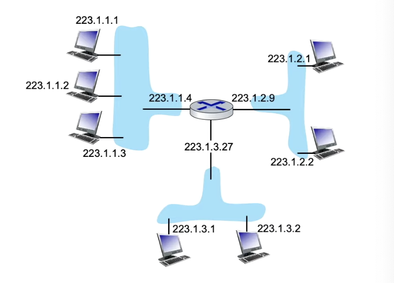

- These interfaces are connected via linked layer technology. 
    - The interfaces may be connected by ethernet switches are a wifi interface (connected by a wifi base station.)

## Subnets

- A subnet is a piece of the network that contains devices that can communicate without going through a network router.
    - AKA, they're connected via some link layer technology.

### Subnet struct IP address

- The IP address has two parts:
    - subnet part, have common high order bits
    - Host part, remaining lower bits.
- To define a subnet:

```
223.1.3.0/24
```
- This tells us the higher 24 bits defines the subnet.


## CIDR

- CIDR is Classless InterDomain Routing
    - Here, the subnet portion of the address is a arbitrary length


```
a.b.c.d/x 
```

- x specify the number of bits in the subnet portion of the ip address.

## How does a host get an IP address?

- Back end, a sysadmin would set it up in a config file.
- DHCP: Dynamic Host Configuration Protocol: The server dynamically get address from as server.

## DHCP 

- DHCP: Dynamic Host configuration protocol.

- DHCP is a server that gives a IP address to hosts.

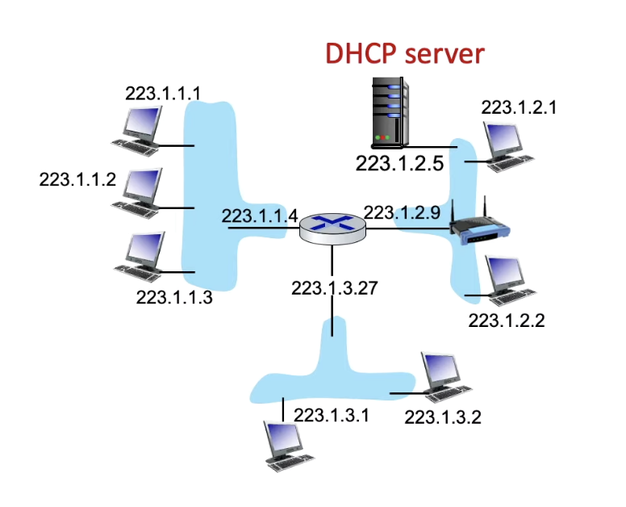

- The DHCP will typcially serve all subnets to which routers are attached.

## DHCP Client Server Scenario

- First, the client will ask if there exists a DHCP server.
- The DHCP server will offer an assigned IP address for the computer. 
- The Client will acknowledge the IP address.
- Finally, the DHCP server will send the address for the client, an ACK message.


## NAT 

- Network Address Translation
    - This will translate the host address into just one IPv4 address, for the outside world.
        - The outside world doesn't really care about the specific device, just the subnet.

- All devices in a local network have 32 bit address in a "private" IP address space.

**advantages**

- Just one IP address needed from provider ISP for all devices
- Can change addresses of host in a local network, without informing the outside world.
- Change the ISP without changing the address of devices in a local network.
- More secure, since devices cannot be accessed directly.

## Implementing a NAT

- The NAT does:
    - replace source IP address and port num to the NAT ip address and new port number.
    - Store all translation pairs (source IP, port #) -> (NAT IP, new port #)
    - replace the NAT IP address and newport with the original source IP and port # in the NAT table.

## IPv6

- IPv4 is only 32 bits, which can only address 4.2 billion devices. 
- We needed more bits to address more devices, so we came up with IPv6
    - IPv6 is 128 bits instead of 32 bits.


### format

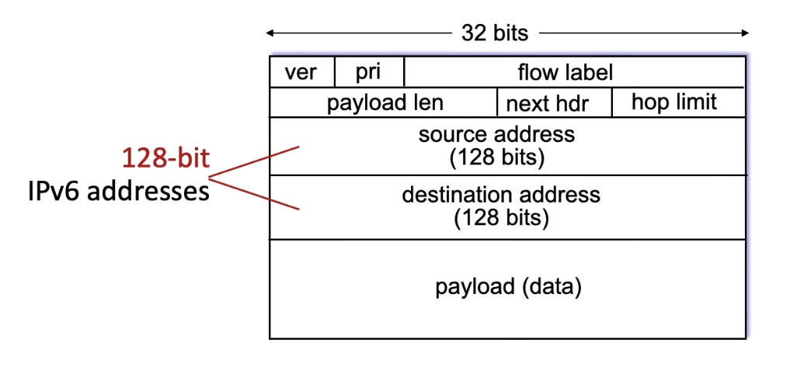

- There's a version number
- flow label, which can be defined depending on the policy of the ISP.
- Priority: Defines the priority of the datagram in flow.
- Payload is the length of the payload, next header is something
- hop limit is similar to TL in IPv4

- Unlike IPv4, there's no checksum, no fragmentation/reassembly or options with the header.


## Transitioning between IPv4 to IPv6

- This transition isn't easy, as we'd have to get rid of IPv4 devices.
- Instead, we have equipment to let IPv4 to interact with IPv6.
    - This is done with a technique known as tunneling.

### Tunneling

- This will take a IPv6 datagram, wrap it in a IPv4 header, making it a IPv4 datagram, then sending that across the IPv4 routers.

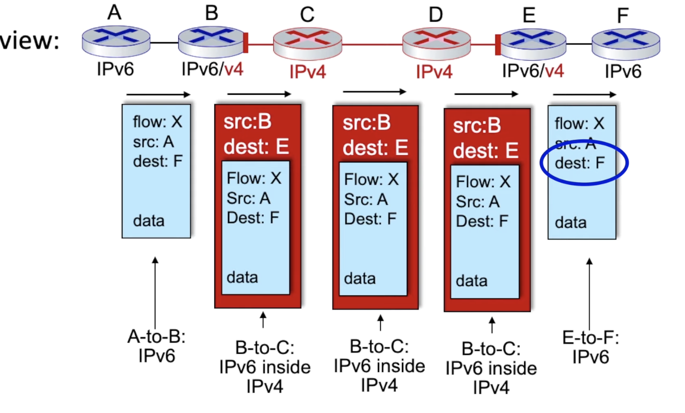

- Here, we encapsulate the IPv6 datagram into an IPv4 at routr B. We then travel through routers C and D. Once we reach the destination E, we unwrap the datagram, getting the IPv6 router. Finally, we can send it to it's destination.

## Generalized forwarding

- Generalized forwarding defines rules for handling packets.
    - match: some pattern to match.
    - actions: the action for the match: drop, forward, modify, etc.
    - priority, some sort of priority
    - counters: number of bytes and packets

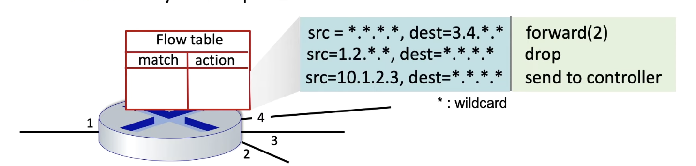

- One example of a policy is openflow.

## Open Flow 

- Open flow defines a flow table enty.

- We break them into 3 parts:
    - match
        - the match looks at the header fields to match.
            - matching can be done at the link, network or transport table
    - action
        - We can:
            - forward packet to ports
            - drop packets
            - modify field in headers
            - encapsulate the forward to controller.
    - stats

### Example

- Firewell blocks datagrams destined to port 22 (SSH port).


## Middleboxes

- A middle box is an intermediary box that performs functions apart from standard functions of an IP router.
- It sets between a source and destination host.

### Examples

- NAT
- Firewall
- Load Balancers
- Content Distribution Networks

## Middleboxes - Whitebox hardware

- These are open API (not proprietary)
- programmable via match + action.