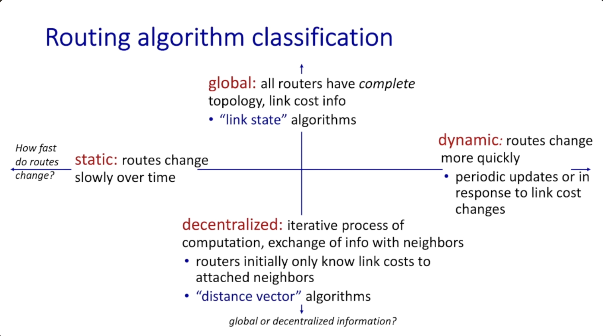
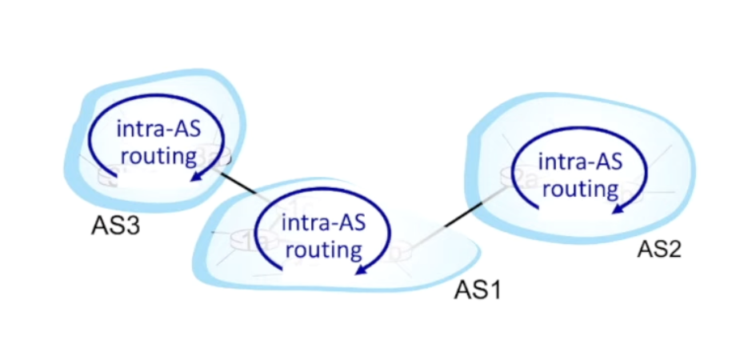
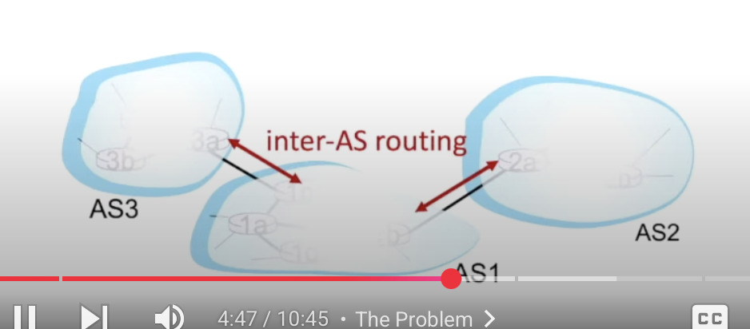
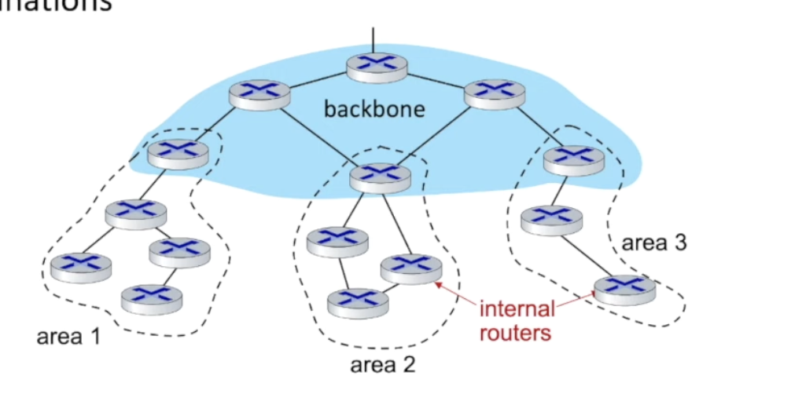
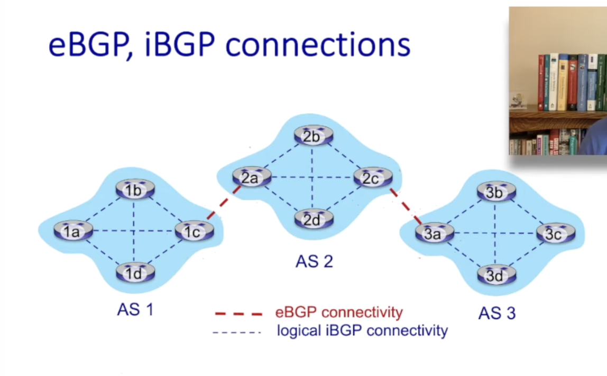
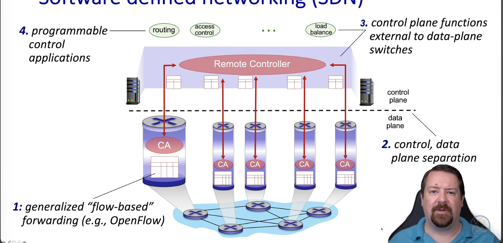

# Chapter 5

## Routing Algorithms

- Routing Algorithms determine "good" paths from sending host to receiving host.
    - The path is a sequence of router packets to traverse through from a given initial source to it's final destination host.
    - good could mean many things:
        - least cost, fastest, least congested, etc.

## Routing Algorithm Classification

## Dijkstras algorithm

- It's centralized, since the link cost is known for all nodes.
- computes least cost path from one node to all other nodes
    - This creates the forwarding table
- iterative: after k iterations, know the least cost path to k destinations.

## Intra AS and Inter-AS

### intra AS

- This alows routing amonger routers within the same autonomous systems.
    - autonomous systems is a group of routers in a region.

- THe routers in the AS must run the same Intro domain protocol.
- Intra AS will typically be used to populate forwarding tables for destinations within the same AS.

### Inter-AS

- Routing among Autonomous Systems.
- Used for entries for destinations outside the AS.

### Protocols

- For Intra-AS routing protocols:
    - RIP: Routing Information Protocol
        - Here, we exchange Distance Vectors every 30 seconds
    - OSPF: Open Shortest Path First
        - Uses dijkstra's algorithm.
        - IS-IS is based off the OSPF protocol
    - EIGRP: Enhanced Interior Gateway Routing Protocol
        - Distance Vector based.
- For Inter-AS Routing:
    - BGP
## OSPF, Heirchial OSPF

- OSPF is the Open Shortest Path First routing algorithm.
- In this algorithm
    - Each router floods OSPF link state advertisements to all other routers in the entire AS.
    - Multiple links cost bandwidth and delays
    - The router knows what the graph looks like, we can use Dijkstra's algorithm to computer the forwarding table.

- All OSPF messages are secure.

### There's also a heirarchial OSPF

- Here, we have a two level heirarchy
    - Now, link state advertisements are flooded only in areas or back bones
    - Each node will have a detailed area topology, only knowing which direction to reach the other destinations.

## BGP Protocol, messages

- BGP (Border Gate Protocol) is a inter-domain routing protocol.

- BGP provides each AS a means to:
    - Obtain the destination networks reachability info from neighboring ASes (eBGP)
    - Determine routes to other networks based on reachability information and policy
    - conveys reachability information to all AS-internal routers (iBGP)
    - advertise destination reachability info.

- here's a visual of eBGP and iBGP

### BGP messages

- BPG sends messages between peers over a TCP connection
    - OPEN: open TCP connection to remote BGP peers.
    - UPDATE: advertise new paths (or withdraw old ones)
    - KEEPALIVE: Keep connection alive.
    - NOTIFICATION: Report errors in previous messages

## Path Advertisements - BGP

- When a BGP advertises a path: it provides a prefix and attribute:
    - prefix: destination being advertised
    - two import attribute:
        - as path: list of ASes through which prefix advertisement has passed
        - NEXT-HOP: Indicated specific internal AS-routir to next-hop AS
    
- Policy-based routing
    - policy dictates whether to accept/reject a path (never route through AS Z, or country Y).
    - policy also decides whether to advertise a path to neighboring AS Z(does the router want to route traffic forwarded from Z destined to X)

## Internet Control Plane

- The Internet Control Plane has been historically implemented via distributed, per router control approaches.
    - Each router contains contains information from the control plane, using protocols like IP, RIP, BGP
    - routers were limited in operations, so they'd need to resort to middleboxes.

- This gave birh to the SDN (software Defined Network)

## SDN

- SDN is the Software Defined Network

- The Control plane will do the routing logic, and send the forwarding tales to the routers.

- This makes network management easier, to avoid router misconfigurations and greater flexibility of traffic flows.

- writing a centralized programming algorithm is much easier to do complex operations.

## SDN architecture

- The routers don't make decisions, they follow the instructions provided by the Control Plane.
    - This is done with OpenFlow
- The control plane handles functions like:
    - routing
    - access control
    - load balancing

- The remote controller can run programable applications that manage network behaviors dynamically.
    - For example, security policies, real time traffic engineering, etc.

## Openflow Protocol

- The openflow protocol operates between controllers and switches (routers)
- TCP is used to exchange messages
- Three classes of openflow messages
    - Controller to switch
        - feature: Controller queries switch features
        - configure: controller queries/sets switch configuration, parameters
        - Modify-state: add, delete, modify flow entries in the open flow tables
        - Packet out: Controller can send packet out of specific switch port.
    - Asynchronous (switch to controller)
        - packet in (router doesn't know what to do with packet, let controller make decision)
        - flow removed: flow table entry deleted at switch
        - Port status: inform controller of a change on a port.
    - Symmetric (misc.)