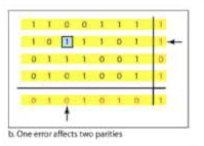

# Chapter 6

## What is the Link Layer?

- The link layer serves as a communication channel that directly connect physically adjacent nodes: done through links  
    - Example: wired, wireless, LANs
- the link layer connects two nodes without any intervening network layer router. (no routers : D)
    - aka: **no network anything**!!! The link layer consist of links and switches, but no routers.

- a frame is a the data unit, or packet for the link layer.

- **tdlr**: The link layer has the responsibility of transferring datagrams from one node to physically adjacent node over a link.

## Link Layer Services

- Framing: Encapsulates datagram into a frame with a header and trailer.
    - Media Access Control (MAC): Manages channel access on shared media.
    - MAC Addressing: Uses hardware (MAC) addresses in frame headers to identify source and destination (different from IP addresses).
- reliable delivery between adjacent nodes:
- Flow control: Pacing between adjacent, sending and receiving nodes.
- Error detection: correct and detect bit level errors
- half duplex and full duplex:
    - half duplex: nodes at both ends of a link can transmit, but not simultaneously.
    - full duplex: nodes at both ends of a link can transmit at the same time.

## Link Layer implementation

- Host link layer implementation
- Unlike previous layers, the link layer involves both software and hardware.

## Error Detection

EDC: Error Detection and Correction Bits.
D: Data protection by error checking

- from the network layer, the datagram will be passed into the link layer:
- Here, the link layer will make a frame cotaining the EDC and D to the datagram.
- The frame will be sent through the link.
- At the dest, it'll check the bits.
    - If it's okay, we're good
    - Other, we either retransmit, or drop.

### Parity Chceking


### Single bit parity
- Here, we set the parity bit to 1 to make the total number of 1s even or odd.
    - even parity, we make the parity bit 1 to make the number of 1s even
        - At the receiver, it'll check if there are an even number of 1s in the data. If there isn't, we know there's an error.

### Two bit parity

- It'll detect two bit errors, and correct single errors without retransmission.



it's basically 2d, so it knows exactly what bit to correct


## Internet Checksum

- Here, we:
    - treat the contents of UDP segment as a sequence of 16 bit integers.
    - do a checksum: we add (one's complement sum) of the segment content.
    - The checksum value is then put into the UDP checksum field.

## CRC

- CRC is the cyclic redundancy check
    - Here, we have:
        - D data bits.
        - G, which is a pattern of r + 1 bits (r is specified in the CRC standard).

```
+-------------+---------+
| D           | R       |
+-------------+---------+
```

- We compute the D and R bits like doing: (d << r) ^ R
    - The sender will compute this such that <D,R> value is exactly divisible by G.
    - The receiver knows G, so it'll divide <D,R> by G. If the remainder is non zero, there's an error.


## Multiple Access Links - two links

- There are two types of links:
    - point to point: 
        - Single sender, single receiver.
        - PPP for dial-up access
    - broadcast links
        - multiple senders, multiple receivers.
            - EX: 802.11, wiriless LAN, 4G, satellite.

## Multiple Access protocols

- Single shared broadcast channel

- When it comes to protocols, we need to know that:
    - interference: when two or more simultaneous transmission by nodes.
    - collision happens if node receives two or more signals at the same time.

- A multiple access protocol
    - A distributed algorithm determining how nodes share a channel.
    - communications about channel sharing must use channel itself.
        - there's no second channel for coordination.

## MAC Channel Protocol

- MAC protocols contain three broad classes:
    - random access:
        - not coordinated, similar to human interaction.
        - It's not ideal, but it's used in the real world.
    - channel partitioning: divide channel into smaller pieces.
        - allocate each piece to node for exclusive use (think of a presidential debate)
    - taking turns
        - Nodes take turns, similar to students raising their hand.

## Channel Partitioning MAC Protocols: TDMA

- TDMA: Time Division Multiple Access:
    - Access to channel in "rounds"
    - Each Station get fixed length slot(Length = packet transmission time) in each round.
    - Unused slots are idled.
    
    - Similar to Round Robin.

## Channel Partitioning MAC Protocol: FDMA

- FDMA: Frequency division multiple access
    - channel spectrum divided into frequency bands
    - each station assigned fixed frequency band
    - unused transmission time in frequency bands go idle


## Random Access Protocols

- Here, there's no coordination between nodes
    - When two nodes send simulataneously, there could be a "collision".

- Random Access protocols will specify.
    - Where to send
    - How to detect collisions
    - How to recover from collisions

- Examples: ALOHA, CSMA/CD, CSMA/CA

## Random Access Protocol Slotted ALOHA

- Simplistic protocol
- Allow collisions to happen
    - then recover via retransmission
- Use randomization to recover from collisions.

- We break our time into time slots.
    - When teh node has a new frame to send, it'll transmit in the next slot.
        - If there's no collision, we're okay.
        - If there is a collision, we retransmit the frame in subsequent slot with probability p until success.
            - We randomize when it attempts to retransmit
            - If we were to immediately retransmit, the collision will happen again.

- It works, but it's very inefficient.

## Random Access Protocol - CSMA and CSMA/CD

- CSMA is carrier sense multiple access.
- In overcomes the flaws of ALOHA

- CSMA is like a more polite version of ALOHA, where you wait for the perosn to stop talking
    - The CSMA sense the channel. If it's idle, send the entire frame.
    - If it's busy, wait until a later point in time.

- A collision can still happen here, which introduces the need for collision detection.

### more polite version is CSMA/CD

- Here, we have collision detection.
    - We stop if a collision happens.
    - The channel will resend the remaining data, saving time.

## MAC Protocols - Taking Turns

- Channel partitioning can be inefficient at low loads
- Random Access is inefficient with high loads, with more collisions

- Taking Turns finds a middle ground:
    - Here, channels are allocated explicitly
    - Nodes won't hold the channel for long.
    - There are two approaches: polling and token passing


## Polling Protocol

- THere's a centralized controller.
    - It'll explicitly invite client nodes to transmit (or send a poll).
    - After the client sends it's messages, the controller will invite another client to send it's data.

- There's a single point of failure, which isn't ideal

## Token passing

- here, nodes will pass to eachother tokens.
- when the node receives the token, it'll send it's message. Once it sends it message, it'll pass the token to the next node.

- There is overhead, but the token is a single point of failure.

## MAC addressing

- MAC Addressing are used locally to get frame from one interface to another physically connected interface (same subnet, in ip address context)
- MAC addresses are 48 bits.
    - Written in pairs of hex digits.

- Unlike subnet ip addresses, the MAC address are unique.
    - the MAC address is set by the manufacturer by IEEE.
    - IEEE assigns blocks to the device manufactuer.
- Unlike subnet IP addresses, MAC addresses don't need to change

## ARP

- ARP: Address Resolution Protocol
- ARP will map an IP address to MAC address.
- There'll be an ARP table, which will contain the IP/MAC address mappings ond the Time to Live, which is the amount of time the entry lives before it becomes stale.

- When a node is looking for a node with the ip address, the protocol will broadcast, asking other nodes if it has the IP address. 
    - Once the device claims the IP, it'll insert the data into the ARP table.

- If the device is on a different subnet, the device will request the ip to the router, the router will get the mac address on it's side, then send it back.


## Ethernet

- Ethernet is the dominant wired LAN technology.
- It's simple, cheap, and fast.

- back then, ethernet used to be a bus. Now, it uses a link layer 2 switch.
    - switches are more efficient.

- The ethernet frame contains:
    - a preamble, for synchronozitanio
    - a dest and source address. (6 byte source and destination MAC addresses)
    - type: indicated high layer protocol: IP, AppleTalk
    - CRC, cyclic redundency check.


- Ethernet is
    - connectionless, as there's no handshaking between sending and receiving NICs
    - unreliable
- Ethernet uses CSMA/CD

## Ethernet Switch

- A Ethernet switch is a link layer device, which:
    - stores and forards ethernet frame.
    - examine incoming frame's mac address and selectively forward frames to outgoing links.
        - CSMA/CD is used to access segments
- The operation of the switch is transparent, so the host is obblivious to the presence of switches.

- Hosts have dedicated direct connect to switch.
- switches buffer packets
- ethernet protocol used on each incoming link
    - No collisions; full duplex
    - each link is its own collision domain

## Ethernet switch forwarding table

- How does the switch know how to switch another table?
    - This is done with a switch table. Each table has:
        - MAC address of host
        - interface to reach host
    
How do we actually go about creating and maintaining forwarding table? With self learning.
