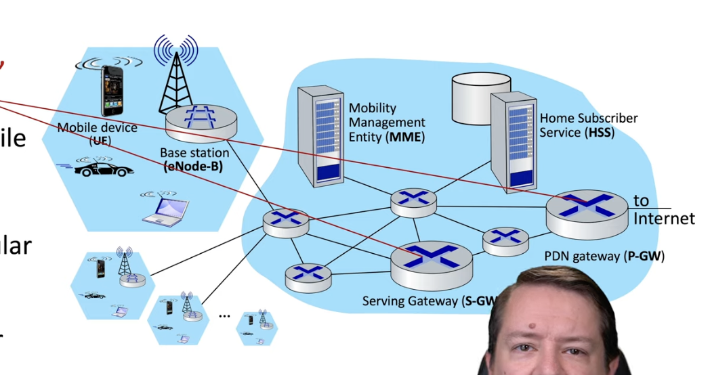

# Chapter 7

## Important challanges shifting to wireless devices

- Wireless: Communication over wireless link (maintaining communication wireless itself is challenging).
- mobility: Handling the mobile user who changes point of attachment to network

## ELements of a wireless network

- We have:
    - wireless hosts: laptops, smartphone, iot devices, devices that make wireless connection
    - wireless infrastructure (base station): these are basically access points: cell towers, 802.11 accesspoints.
    - Wireless Links: connect mobile devices to base stations.
        - will have various transmission rates.

    
## bandwidth and range tradeoff

- When you have a higher bandwidth, the range descreases, and vice verse.
    - aka, the signal, when the bandwidth is higher, will propogate quicker.

## ad hoc wireless networks

- This is another form of the wireless architecture, but without base stations.
- Instead, nodes can only transmit to other nodes within link coverage.
- nodes will organize themselves into a network, route among themselves. 

## infrastructure vs no infrastructure

- infrastructure networks:
    - here, there will be a central base station or access point (wifi, cellular networks)
- no infrastructure networks will not have a central coordinatng base station.
    - Instead, devices will communicate directly (ad hoc networks)

## single hop vs multiple hops

- Single hop: the host device can communicate directly with the base station or target device in one hop
- Multiple hop: the host needs to relay data through other devices to reach the destination or base station.

## wireless vs wired links

- Wireless signals are weaker compared to wired signals.
- Wireless links are highly susceptible to interference from other sources
    - ex: other devices may use the same frequency
- multipath propagation: radio signals can reflect off other objects, result in it arriving at its destination at different times.

## SNR and BER tradeoff

- SNR is the Signal to Noise Ratio.
    - A higher BNR means a better quality signal, so it's good.
- BER is the Bit Error Rate, which is the num of error bits / num of total bits.

### SNR and BER tradeoff

- Increasing the SNR will decrease BER.

## Hidden Terminal Problem

- here, say you run some distribution algorithm. The Hidden terminal problem says that it's not guaranteed that all the nodes won't be able to hear eachother.

## CDMA

- CDMA: Code Division Multiple Access

- Here, a unique code is assigned to each user.
    - All users will share at the same frequency, but each user will have it's own mechanism to encode data. 
    - These encodings will ensure multiple users can coexist and transmit simultaneously with minimal interference.

- encoding is typeically the inner product of (Original Data) X (chipping sequence).
- decoding is done via the summed inner-product: (Encoded data) X (chipping sequence).

## 802.11 protocol

- The 802.11 is the wifi protocol
    - Older versions will run at 2.4 Ghz, newer versions will run at 5 Ghz
- In this architecture, wireless hosts communicate with base stations.
    - A base station is known as an access point (AP).
- A Basic Service Set (BSS)—also called a cell—contains: 
    - Wireless hosts
    - An access point (in infrastructure mode)
- Ad hoc mode:
    - No access point is used
    - Wireless hosts communicate directly with each other

## 802.11: Channel, Association

- The spectrums are divided into channels at different frequencies.
    - Here, the AP Admin will choose a frequency for Access point.
    - Channels can be the same as chosen by neighboring Acess points
- Arriving hosts will associate with a Access point.
    - Here, the host will scan channels, listening for a beacon frame, containing the AP's name (SSID) and MAC address.
    - After, the host can choose the AP to associate with.
    - Finally, the host can run DHCP to get it's IP address

## 802.11: passive vs. active scanning

- With passive scanning:
    - first, the new host will go into listen mode, where it'll iterate through all channels.
    - Once the host receives the beacon frame from the AP, the host sends an association request frame, and receive the association response. 
- Active scanning:
    - The host sends out a probe request.
    - The AP will send a probe response containing the same contents of the beacon response. 

## 802.11: collision avoidance, RTS/CTS.

- CSMA senses before transmitting.
    - don't start transmitting if it detects ongoing transmission by other nodes.
    - If the collision is detected, it'll start a random backoff time.
        - If the sender doesn't send an acknowledgement, it'll increase the backoff interval.

- The receiver:
    - when it send the data frame, it'll send an ACK.
    - It tells the sender that there were no collisions.

- A quirk of 802.11 is the lack of collision detection.

- There's also RTS and CTS, which is good for more congested channel.
    - The channel is reserved for users.

- With this approach:
    - the sender will first transmit a small request to send (RTS) packet to the BS
    - The BS broadcaster will send a CTS (clear to send) response.

## 802.11 header format

- The 802.11 header will include 4 addresses:
    - mac address of wireless host or AP to receive frame.
    - MAC address of wireless host or AP transmitting the frame.
    - MAC address of router interface to which AP is attached
    - Another use only used in ad hoc mode.
- there's also the duration of the reserved transmission time (RTS/CTS)
- there's also a frame sequence number, which identifies which frame is being sent.

## 802.11: rate adaptation

- Based on the SNR, the base station and host will negotiate a high encoding rate. If it degrades, it'll downgradet he encoding. 

## Bluetooth

- Bluetooth is a personal area network.
    - Here, the network diameter is 10 m
    - meant to replace a cable.
    - ad hoc: no infrastructure.
    - has a master controller, and client devices.
        - here, the master will poll clients, to see if it has anything to send.
    - collisions exist, but bluetooth uses a parked mode, so it sleeps if it isn't being used.

## 4G/5G cellular networks

- Cellular networks allow for wide area mobile internet.

- most areas are connect by mobile broadband stations

## Cellular network vs. mobile networks

- There are several similarities:
    - edge/core distinction.
    - global cellular network.
    - use of protocols (HTTP, DNs, TCP, UDP, etc.)
    - interconnected to wried internet.
- There are several differences:
    - has a different link layer.
    - The user is tracked, for billing purposes.
    - authentication is needed for security. 

## 4G LTE architecture

- Similar to other architectures, there's the hosts devices on the edge.
- The base station manages it owns area, containing a unique id. 
- the base stations connected to a network core, containing the mobility management entity, and a home subcriber service.
    - the home subsriber service keeps track of user using data.
- there are lotta routers.
- The mobility router entity handles device authentication, managing the real time state of devices connection. 

## LTE: Data Plane vs. Control Plane

- Like previously learned, LTE also has a data and control plane
    - The data plane: makes heavy use of tunneling protocols (aka, just focuses on transferring data)
    - The control plane, implements protocols for mobility management, security and authentication.

## LTE Data plane: first hop

- The LTE link layer protocol contains:
    - packet data convergence
        - compression, encryption
    - radio link control
        - handle fragmentation/reassembly, reliable data transfer
    - medium access: requests and uses radio transmission slots.