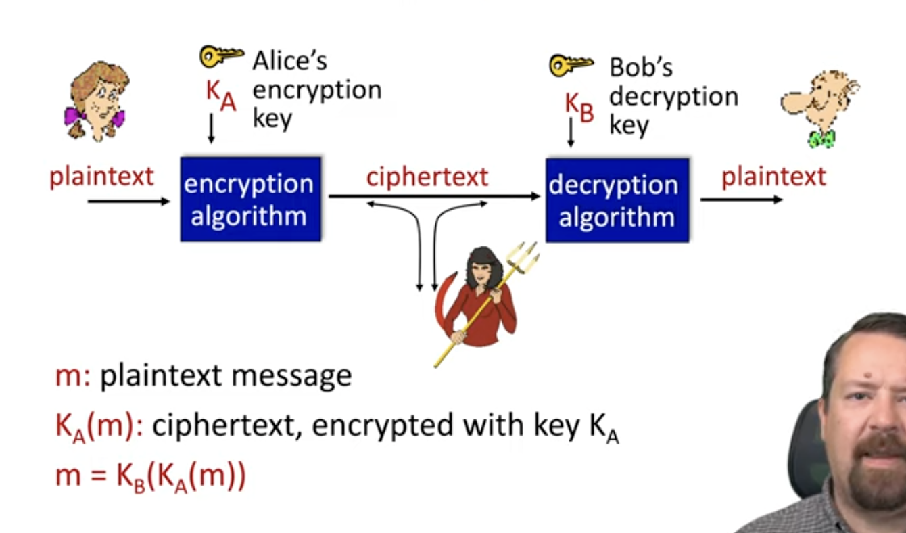
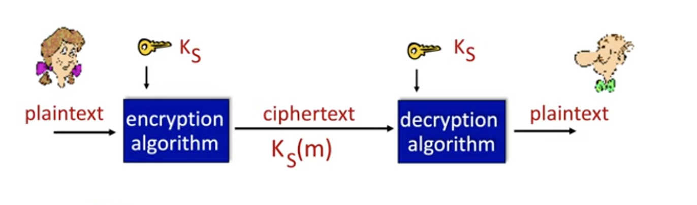
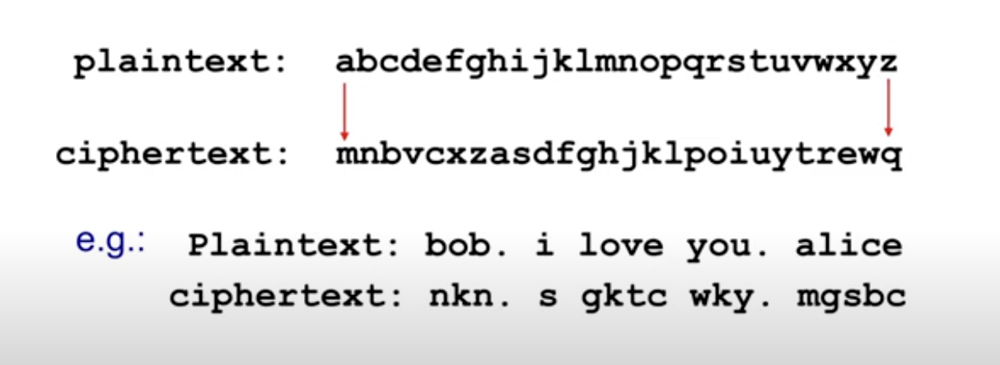
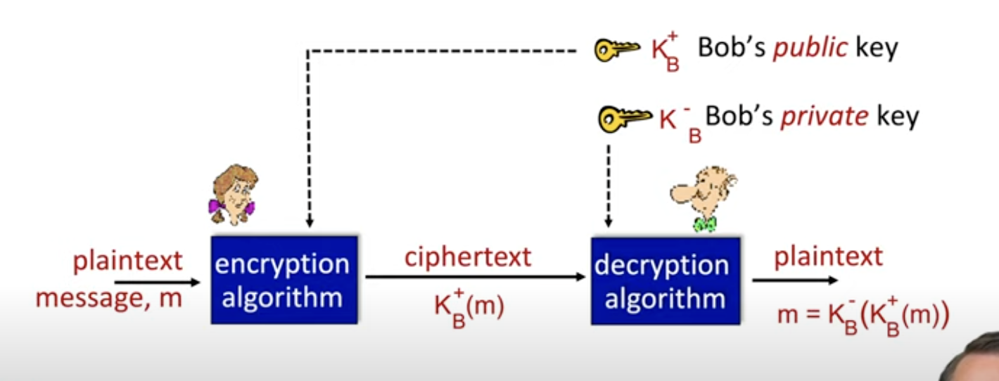
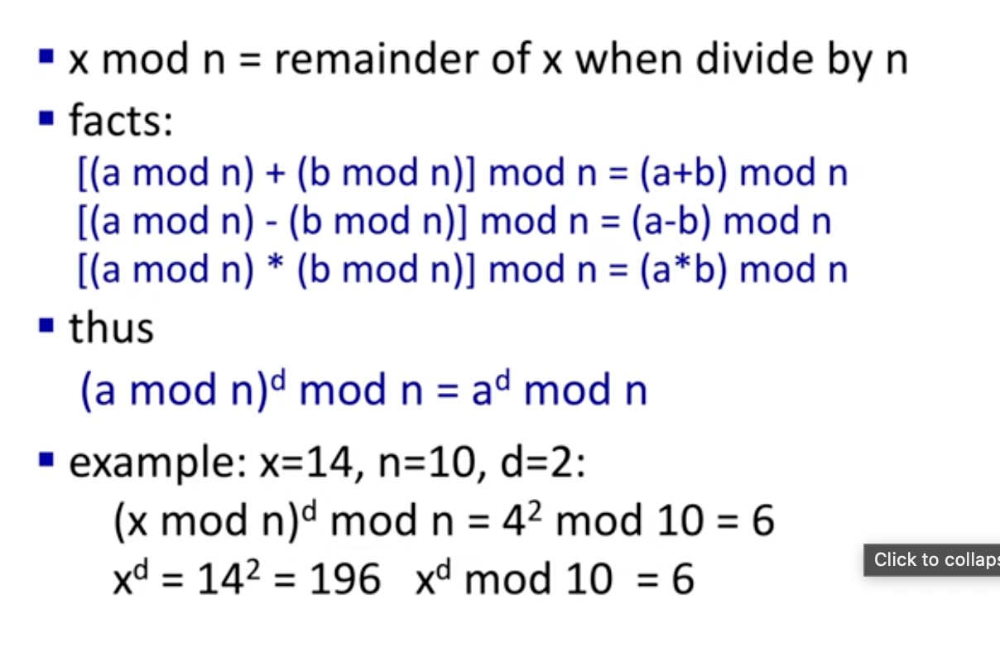
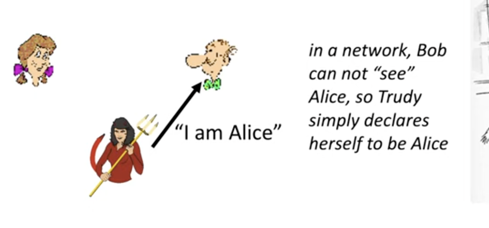
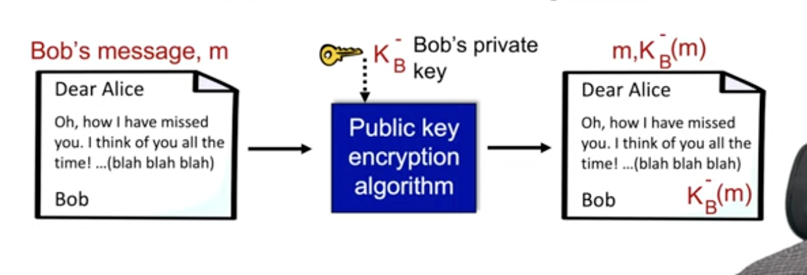

# Chapter 8 - Network Security

## What is Network Security?

- There are things that come in mind:
    - Confidentiality: only the sender and receiver should understand the message contents (AKA, we don't want a third party to see the message). 
        - This is achieved with encryption.
    - Authentication: Sender and receiver want to confirm the identity of each other.
    - Message Integrity: We don't want the message to get altered without detection.
    - Access and availability: These services should be readily accessible for users (technical and non-technical users).

## Crytography jargon

- Plain text is the human language, original data.
- Encryption algorithm is the algorithm, provided with an encryption key.
    - The encryption algorithm creates the cipher text.
- Once the cipher text arrives, the decryption algorithm decrypts the cipher text into it's final plaintext.
    - Bob will have the decryption key. 

## Encryption Schemes

- **cipher-text only attack**: the attacker can get the ciphertext, and try to figure out how to decrypt it
    - They can use statistical analysis or use brute force.
- **known-plaintext attack**
    - If you have the plain text and ciphertext, you can try to reverse engineer the key.
        - This will let the hacker to get ciphertext for a chosen plaintext.

## Symmetric Key Crytography

- Here, alice and bob share the same key for encrypting and decrypting messages.

- There are issues:
    - If alice tries to send the key to bob, it'll be encrypted and bob can't decrypt it
    - If alice sends the key without it being encrypted, it lets evil people have access to alice's key.

## Substitution Cipher, n substitution cipher

### Substitution Cipher

- This is naive, as it'd just substitute one letter for another:

- We substitute one letter at a time.
- This is not secure, and statistic analysis can be used, to figure out the substitutions.

### N Substitution Cipher

- Here, we apply multiple layers of substitution ciphers. Here, it makes it more difficult to do statistical analysis.

## DES

- DES is the data encryption standard
- there's a 56 bit symmetric key and a 64 bit chunks for the  plaintext input.
- Each chunk is encrypted resulting in a cipher block chain.
- DES can be decrypted in less than a day with brute force, but it lacks the statistical features substitution had.

- To make it more secure, you can perform DES 3 times, which is known as 3DES.
    - When you do it 3 times, it appears random. It's not obvious to decrypt it.

## AES

- AES is the Advanced Encryption Standard.
- It uses 128 bit chunks for efficiency, and larger bit key.
- With brute force, what would take 1 second on DES would take 149 trillion years for AES.

## Public Key Cryptography

- Symmetric Key cryptography requires the sender and receiver to have the same secret key.
- This brings up a question, how do these two agree on a key in the first place?

- In public key crptography, the sender and receiver have their own public and private key.
    - The public key is known to all.
    - The private key is only known to the receiver.

- Here, alice uses Bob's public key to send a message. 
- Bob uses his private key to decrypt the message.

## Public key encryption algorithm reqiuirements

- We need two keys such that, if one key encrypts the message, the other one should be able to decrypt it. 
- Given a public key, it should be impossible to compute a private key.

## Modular arithmetic

## RSA encryption

- The message is a bit pattern, which we can represent as an integer.
    - In other words, encrypting a message is equivalent to encrypting a number.

## RSA - Creating the public and private key

- We need to choose 2 large prime numbers, p and q.
- We compute n = pq, and z = (p - 1)(q-1)
- choose a value e (where e < n) and has no common factor with z (e and z are relatively prime.)
- We chose d such that ed - 1 is divizible by z.

- Public key is (n,e), private key is (n,d).

## RSA: Encryption, Decryption

- Public key is (n,e), private key is (n,d).

- to encrypt a message m (<n ), we do m^e mod n
- to decrypt the message, we do c^d mod n

## Authentication

- In a network, the devil or alice can say, "I'm alice".
    - We cannot prove if it's alice. We need authentication to prove Alice is actually alice and not some attacker.

## Message Integrity, Digital Signatures

- This tells us if the message was changed enroute. 
- We want to confirm that the receiver gets the message without it getting compromised. 

- Bob will sign the document and send it. Alice should be able to prove that Bob's signature is correct, and not changed.
- A simple approach
    - Send signed message encrypted with bob's private key.
        - Here, anyone with bob's public key can decrypt the message. If it makes sense, it means it's bobs.
            - If the public key can decrypt the message, it must've had the correct private key.

## Hashing Functions

- encrypting and decrypting messages can get very expensive. Instead, we use hash functions, which will compress messages into smaller types.
    - Instead of a large message, it becomes a smaller number.
- Cons include that there can be hash collisions, meaning two values can get the same hash values.
- A con of hash functions is that you can decrypt a message with a hash number.

## Public Key CA

- CA is certification Authority, which binds a public key to a particular entity, which is a business, person, etc.
- The entity registers it's public key with CE to prove it's identity to CA.
    - When it's authenticated, the public key is final. 