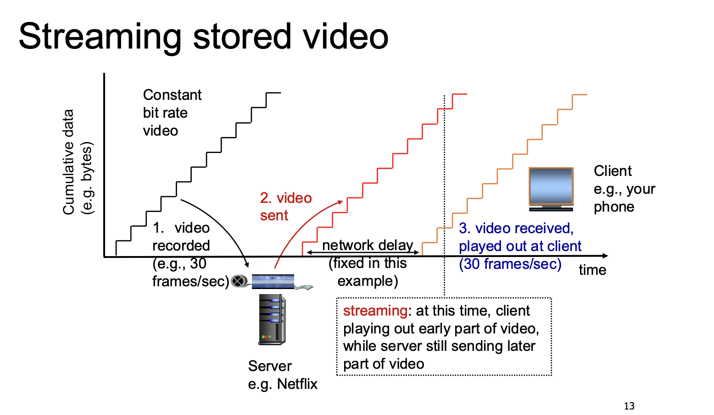
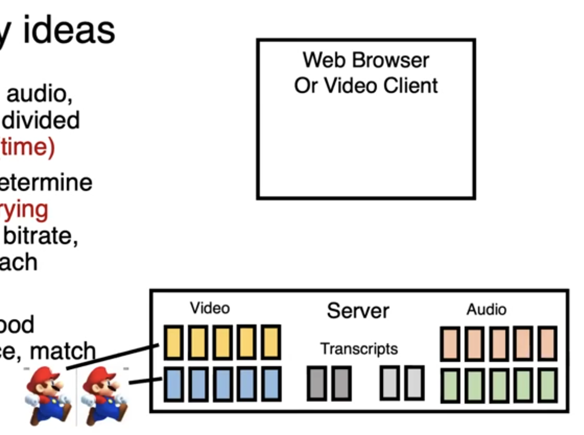
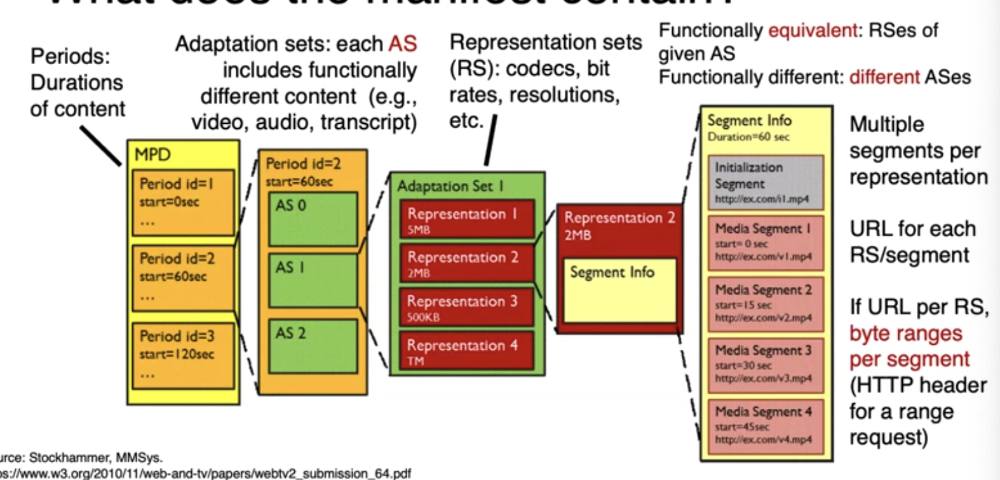

# Chapter 9

## How do we represent audio?

- Audio is analog in nature. We need to convert analog signals to digital representations.

- We can do this with:
    - sampling: How many samples to take in a period. In other words, let's look at snippets of the audio.
    - Quantization: We think of audio signals as a sequence of discrete values.
        - We take every sample, and represent the sample with a finite number of bits.
            - More bits, more accurate representation, but we need more bits to store and bindwidth to transmit.
    - Compression: compact the representation of quantized values.

## Given audio with a 8000 sample / sec, 256 quantized value, what's the bindwidth we need?

- we need 8 bits to represent 256 different values. We can multiply 8 by 8000 to get the bandwidth, which is 64000bps

## Video representation

- Video is nothing but a sequence of images displayed at a constant rate.
    - For example, 30 images / sec is 30 frames per second.

### Image representation

- An image is an array of pixels, where each pixel is represented by bits.
    - The number of pixels used to represent the image is known as the resolution.

### Stream video

- Sending every frame is repetitive, so it'll take advantage of this to reduce the number of bits to send. There are two types of redundancies:
    - Spatial  (grouping the pixels together, instead of sending individual pixels.)
    - Temporal (only sending different pixels. no need to send the same pixels from the previous image. )

## Video Codecs, terminology

- This rendering is done with a codec, which is a algorithm that does encoding and decoding, for videos doing the spatial and temporal things. 

- Video bit rate, effective number of bits per second of the video after encoding. 
    - This depends on factors like resolution of each image, detail, movement, etc. 

## bit rates in videos

- Bit rate tells us how many bits to send. It changes over the duration of videos
    - If there's more movement, we need to send more bits. 

- CBR (constant bit rate): fixed bit rate video
- VBR (Variable bit rate): adjusts bit rate depending on the encoding rate. 

## Streaming video/multimedia, types

- There are three means to view videos and multimedia:
    - on demand streamed video/audio (netflix, spotify, etc.)
    - conversational voice or video (zoom)
    - live streamed audio/video (twitch.)

## On Demand streamed audio and video.

- Here, media is prerecorded at different qualities.
- When the client starts watching, the client will download the initial portion, and continue downloading as the video progresses.

- It'll load the additional frames before it runs out giving smooth video play.

## Adaptive bit rate video

- Given an average fill rate, x, and the playout rate r:
    - if x < r: the video buffer will empty, causing stalls.
    - if x > r, we won't have enough space to store the frames in the buffer.
- This introduces adaptive bit rate.

- We can observe the following:
    - Videos come in different qualities (comes in different average bit rates).
    - Different segments of video can be downloaded separately.

- With adaptive bitrate, we want to adjust the bit rate per segment through collaboration between the video client, based on conditions at the client and server.
    - We sample the performance of the video, and adjust based on this. 

- Youtube does this, by adjusting the resolution.

- One strategy to do this is buffer based rate adaptation.

## Buffer Based Rate Adaptation

- If there's a large stored buffer of the video at the client, optimize for video quality.
- Here, the video client will avoid stalls, by asking for a lower quality, so the server sends a lower bit rate segment. 

- We measure the buffer in seconds of playout left before stalling.

## DASH

- DASH: Dynamic and Adaptive Streaming over HTTP.

- Early on, videos used UDP for video streaming. The issue is that it's unreliable.

- DASH came into fruition, used by most video services today. 
    - We divide content into segments
    - We use algorithms to determine and request attributes, like bitrate, language (subtitles), for each segment

- The server will contain the video, audio, transcripts, and other components.

- The server will give a manifest file, telling the client what video, audio and trascripts are available. 
- The DASH server is a typical HTTP server, except you retrieve video, audio and transcripts. 
    - DASH lets you leverage existing web infrastructure, like CDN and DNS, so instead of having the stuff on one server, you can distribute it between servers.

## DASH - Manifest files

- The manifest will contain pointers to where to get the video chunks from.

