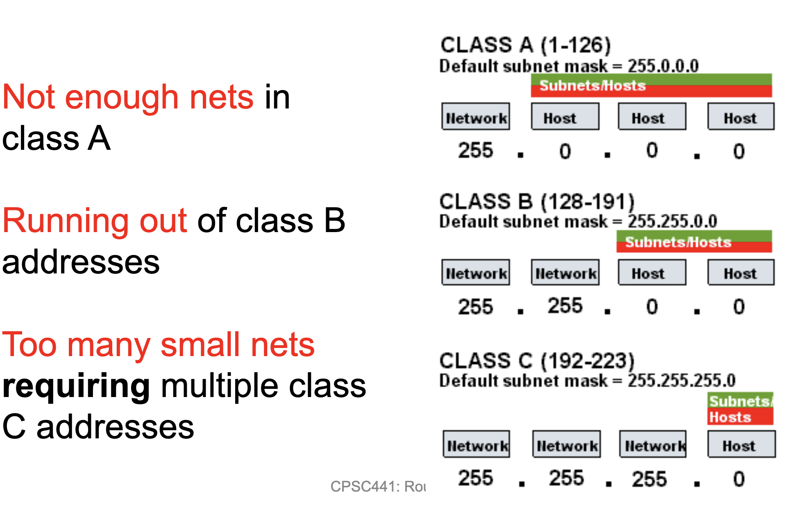
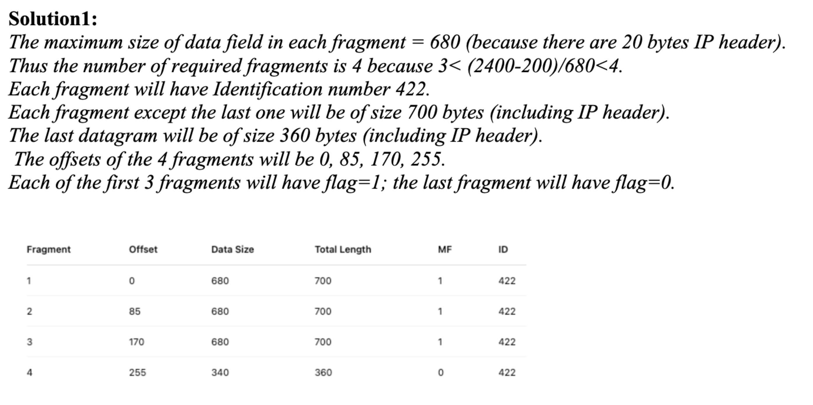
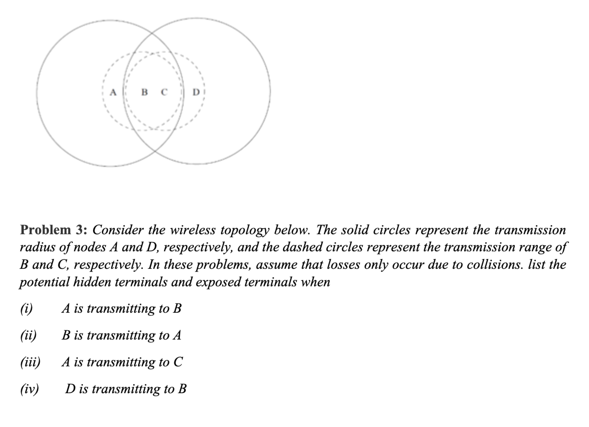
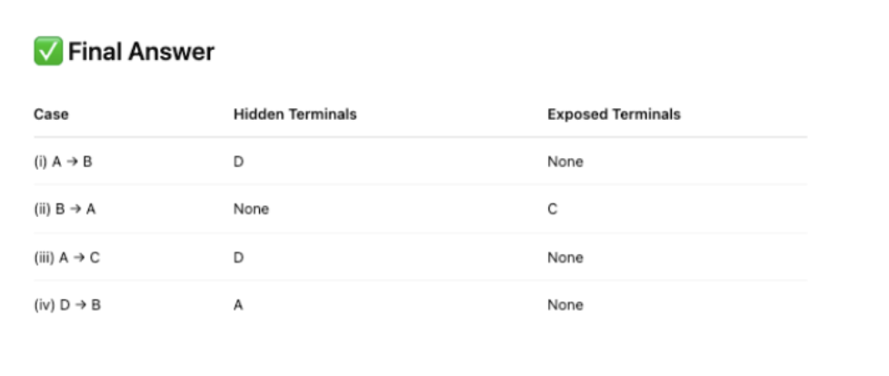
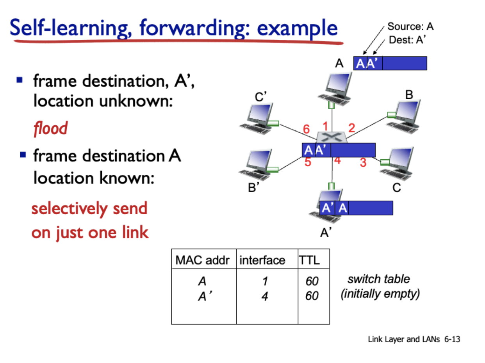

# Final quizzes

## List three main classes of MAC protocols

- Channel Partitioning
- random access
- taking turns

## List two examples of channel partitioning MAC protocols

TDMA(Time Division, Multiple Access) and FDMA (frequency division, multiple access)

## List two examples of “taking turn” MAC protocols

- polling
- Token passing

## List two kinds of routing algorithms

- Dijkstra's algorithm
- Distance Vector Table (bellman ford)

## List three key drawbacks of the slotted ALOHA protocol

- Collision, wasting slots
- idle slots
- clock synchronization

## List the main problem for Class A, B, and C IP addresses, respectively

## List three different IP Support Protocols and their key functions.

- ARP (Address Resolution Protocol): Convert IP to mac address
- ICMP (Internet Control Message Protocol): Used for diagnostic and error-reporting purposes.
- DHCP (Dynamic Host Configuration Protocol): sets a dynamic IP address to host devices

## Please explain the binary (exponential) backoff of CSMA/CD.

- When two devices detect a collision on the network, they:
    - Stop transmission immediately.
    - Wait for a random amount of time before attempting to retransmit.
    - The random wait time is determined using the binary exponential backoff algorithm.

### Binary Exponential backoff. 

- It'll generate a random ammount of time to wait before retransmitting.
- The more collisions, the range of random numbers doubles in size.

## Problem 1: Consider sending a 2400-byte datagram into a link that has an MTU of 700 bytes. Suppose the original datagram is stamped with the identification number 422. How many fragments are generated? What are the values in the various fields in the IP datagram(s) generated related to fragmentation?

## (a) Consider a router that interconnects three subnets: Subnet 1, Subnet 2, and Subnet 3. Suppose all of the interfaces in each of these three subnets are required to have the prefix 223.1.17/24. Also suppose that Subnet 1 is required to support up to 63 interfaces, Subnet 2 is to support up to 95 interfaces, and Subnet 3 is to support up to 16 interfaces. Provide three network addresses (of the form a.b.c.d/x) that satisfy these constraints.

- Subnet 1: 223.1.17.0/26
- Subnet 2: 223.1.17.128/25
- Subnet 3: 223.1.17.192/28 ( if ignoring the network and broadcast addresses)
- Subnet 3: 223.1.17.64/27 (if considering the network and broadcast addresses )

## Image

## What are the function and format for the IP address and MAC address respectively?

- IPv4 uses a 32 bit address, formatted in 8 bit chunks
- MAC is 48 bits, 6 groups of 8 bits, expressed in hex

## What are the two key similarities between switches and routers?

**similarities**
- both are store and forward.
- both have forwarding tables
**differences**
- Routing is a network layer device
- switches are a link layer device.

## In the selfing learming of switch, what will a switch do (a) if the frame destination location is known and (b) if the frame destination location is unknown?

