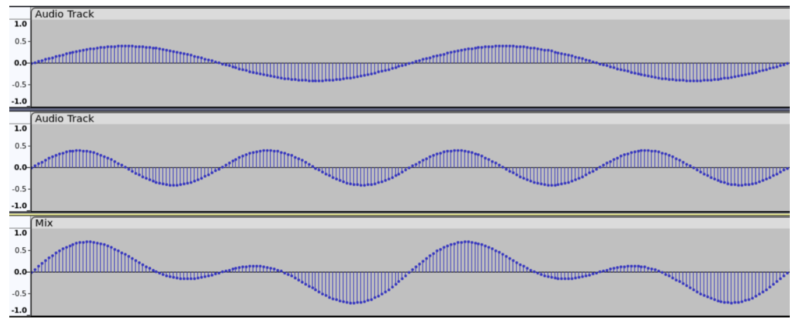

# 1. Digital Audio Representation

## What is sound

- Sound is caused by vibrations
    - vibrations create waves travelling through a medium.
- Sound is usually represented with a sine wave, but can vary depending on what it's traveling through.

## Sound Characteristics

- The pitch of the sound is measured in Hertz (frequency)
- The amplitude, or loudness, is measure with Decibels.

## Sonud Digitalization - sampling

- Sound waves are a continuous analog signal.
    - this means there's an infinite number of points.
- At any point of the curve, we can measure the audio level at the point.
    - This is known as a sample, and wake take samples at a regular interval to have the digital representation of the sound.

## Sample Rate - what is it, shannon-nyquist theorem

- The sample rate defines the number of samples taken per second.
- We need to take enough samples to properly approximate the sound.
    - The **Shannon-Nyquist theorem** states the sampling frequency should be double the maximum sound frequency. 

## Sound digitalization - sample size, resolution

- we can see here, there are points. These are the we take.

- It varies from 0 to it's maximum amplitude value.
    - if the amplitude is 1, it varies from -1 to 1.

- The number of bits used to represent the sample size is the resolution.
    - common sample sizes are 16 and 24 bits. 

## Storing samples in memory/disk

- There are multiple wyas to store samples in memory or on the disk:
    - as signed integers
    - as unsigned integers
    - as floating points.

- They're also stored in either little endian of big endian.
- For 24 bit samples, we'd either store them in 3 byte chunks, or in a 4 byte chunk with the last byte being ignored.

## LPCM

- LPCM is **Linear Pulse-code Modulation**.

- this is the approach where we store sound as a sequence of samples, and the specific sample rate used.

