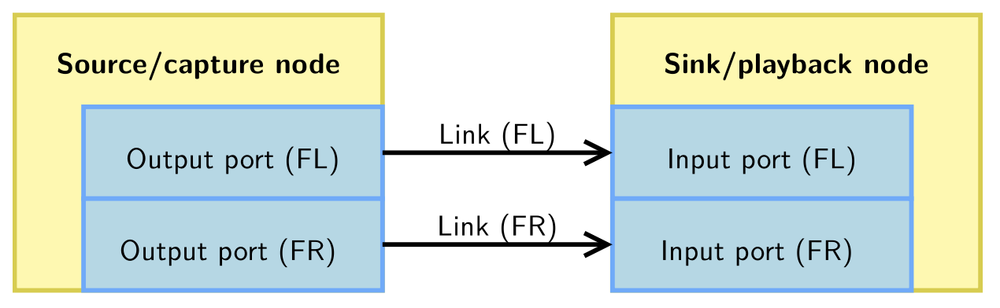

# 10. Pipewire

## What is pipewire?

- Pipewire is a realtime multimedia "data graph"
    - A "data graph" is a system/structure that manages multimedia data
- Allows for:
    - sharing of devices accross processes.
    - Offers dynamic routing at runtime
    - implements format negociation & conversion
    - modular audio processing, spread across linux processes.


## pipewire - objects

- The graph state (system that manages multimedia data) is represented with a list of "objects"
    - this list is handled by a "core" object hosted by the pipewire daemon.
- Each connected process is represented by a "Client" object

## pipewire - Nodes, ports and links

- The graph in represented with the following object types:
    - `node`: processes samples
    - `port`: represents node input/output
    - `link` connects output port with input port



## pipewire - object properties and params

- Objects are defined by their ID and type
- Objects also contain **properties**:
    - these are a list of key-value pairs.
    - Examples: `media.autoconnect = \"true\"`
- Objects contain **params**, which are configurable by other clients:
    - these are configurable by other clients, and used for things like volume control.

## pipewire - devices

- another object type are devices:
    - these map to physical devices, which are assigned one or more nodes.
- providers include alsa-lib, BlueZ, libcamera, etc.

## Pipewire - graph execution logic, nodes, counters, targets

### nodes 

- Pipewire structures itself as multiple subgraphs
    - There's one **driver** node and a **follower** node.
- The device node triggers at the start of execution cycles (based on timer/hardware interrupts )

### counters
- each node will maintain two counters:
    - required, number of dependencies on other nodes.
    - pending: how many remaining nodes need to be executed before it can run.

### targets

- nodes responsible for decrementing targets' pending counter.

## pipewire - graph execution logic, priority level

- Driver nodes are picked based on their `priority.driver` property.
- A good default is to set a higher priority on capture driver nodes.

## pipewire - graph execution logic, client and modules creating nodes

- The pipewire clients and modules can create independent nodes.
    - this means there can be multiple subgraphs, each driven by a different driver node.

## graph execution, quantums

- The **quantum** is the number of samples to be generated during a cycle.
- You can globally define the minimum and maximum quantum, and each node can request for specific rate.
- node can also have locked quantums, which guarantees the quantum doesn't change.

## Pipewire Communication Protocol

- In order for processes to communicate with the pipewire daemon process, you create a socket (via `socket`) named, by default, `pipewire-0`.

## Pipewire - configuration file name/location

- Each pipewire client will locate and read it's configuration at startup.
- lookup order is as follows:
    - `~/.config/pipewire/`
    - `/etc/pipewire/`
    - `/usr/share/pipewire/`

- The config file's named `client_rt.conf`

## pipewire - configuration file

```conf
context.properties = {
    link.max-buffers = 16
    log.level = 2
    core.daemon = true # listening for socket connections
    core.name = pipewire-0 # core name and socket name

    # Properties for the DSP configuration.
    default.clock.rate = 48000
    default.clock.allowed-rates = [ 48000 ]
    default.clock.quantum = 1024
    default.clock.min-quantum = 32
    default.clock.max-quantum = 2048
    default.clock.quantum-limit = 8192
    # ...
}
```
- **context.properties** configures the pipewire instance

```conf
context.spa-libs = {
    # <factory-name regex> = <library-name>
    # Maps a SPA factory to its parent library.
    audio.convert.* = audioconvert/libspa-audioconvert
    avb.* = avb/libspa-avb
    api.alsa.* = alsa/libspa-alsa
    api.v4l2.* = v4l2/libspa-v4l2
    api.libcamera.* = libcamera/libspa-libcamera
    api.bluez5.* = bluez5/libspa-bluez5
    api.vulkan.* = vulkan/libspa-vulkan
    api.jack.* = jack/libspa-jack
    support.* = support/libspa-support
# ...
}
```
- **context.spa-libs** maps plugin features with globs to a SPA library.

- There are other ones:
    - `context.modules` is an array of dictionaries, containing arguments, flags and conditional expressions.
    - `context.objects` is another array of dictionaries.
    - `context.exec`is another array of dictionaries, which contains executables to start on startup


## `pw-config`

- `pw-config` is a utility to dump given config files.
    - This can check if config files work as intended.
- `pw-config paths` lists all config paths, including overrides
- `pw-config list` detail all config sections.

## `pw-dump`

- This dumps the graph as a json array of all objects known to core. 
- you can filter by ID/name as well

## `pw-cli`

- this is a cli tool to interract with pipewire.

## `pw-top`

- this is a tool to get a quick overview of current graph nodes and structure.

## `pw-profiler`

- profiles all running nodes.

## `pw-cat`

- utility to play/record media files.

## `helvum`

- A real time 2D patchbay
- visualizes the graph, and lets you create/delete links.