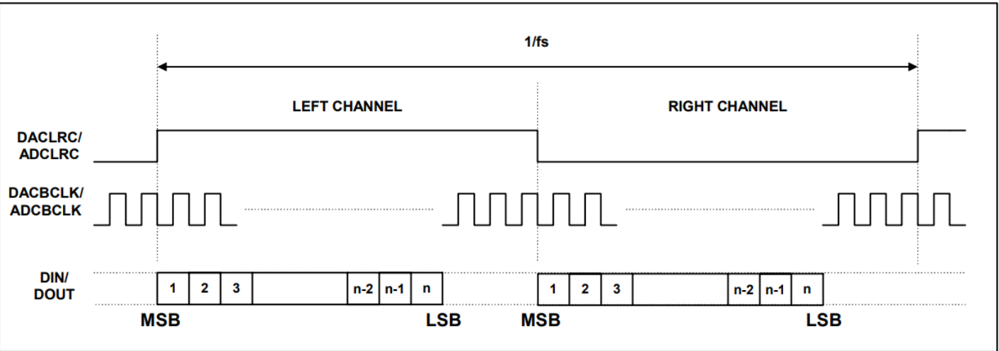
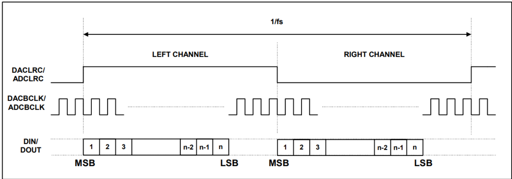
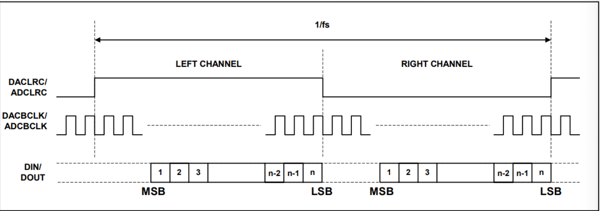
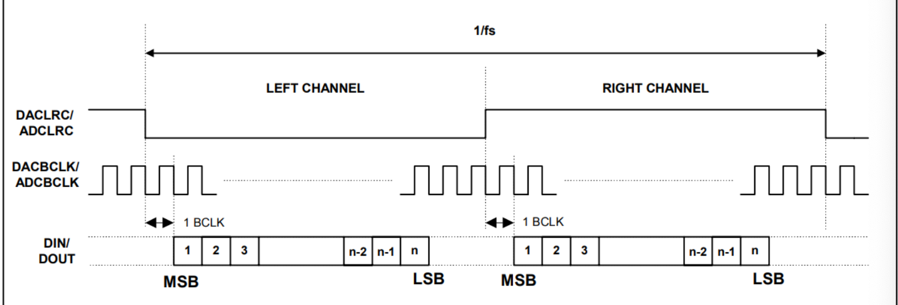
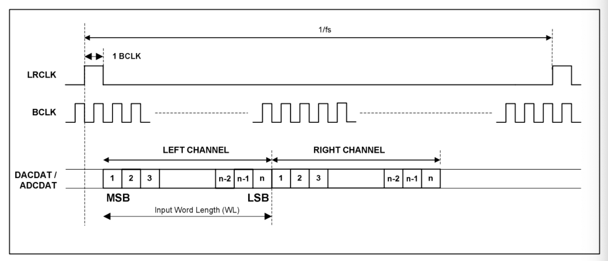

# 2. Embedded Audio Hardware

## General anatomy of audio hardware

- SoC talks to a **codec**, which sends the analog audio signal to the amplifier. 

## What are CODECS? Components

- A CODEC is a device and codes and decodes audio samples

- CODECS will usually integrate a **Analog-to-digital converter (ADC)** and **Digital-to-analog (DAC)** converter within the one chip.
- There will be multiple **Digital-Audio-Interfaces (DAI)** to transfer samples to/from a microcontroller or microprocessor.
- There will also be an extra bus for configuration.

## What is a CODEC DAI, clocks

- The CODEC DAI is a synchronous serial bus:

- There are two clocks:
    - **bit clock**: provides timing for each individual bit of data within audio frame.
    - **frame clock**: provides timing to indicate the beginning of each audio frame.
        - indicates which channel (left and right in stereo system) the data corresponds to.

    
## CODEC Digital Audio Interface - Data

- CODECs will have multiple data in/out lines, one line per channel pair.
- CODECs could have multiple DAIs, each for full interface for data in and another for data out. 

## SoC Digital Audio Interface

- The SoC will have it's own dedicated synchronous serial interface. 
    - Some will be generic serial interfaces
    - Other's will be dedicated to audio formats.
- There'll usually bea DMA controller to copy samples from memory to the serial interface register. 

## Bit clock vs. Frame clock

- The frame clock indicates when to send the new frame.
- bit clock defines the timing for transmitting bits. 

## Auxiliary devices

- auxuliary devices are devices that are on the analog path of the audio signal.
    - Examples include amplifiers, potentiometers (things that aren't the CODEC itself).
- Some auxiliary devices can be controlled.
    - Therefore, it should be exposed as controls of the sound card

## Digital Formats

- There are multiple ways to send audio data via signals.
    - The type varies by the hardware (think endianness)

### 1. Left Justified

- here, we start sending data immediately after there's a change in the frame clock signal

### 2. Right Justified

- Here, the bits align at the end of the frame clock tick.

### 3. I2S

- Here, the data starts being sent after 1 block bit after the frame clock change.

### 4 and 5, DSP A/B

- here, you start sending data back to back, the moment the frame clock rises.

- There are a lot more