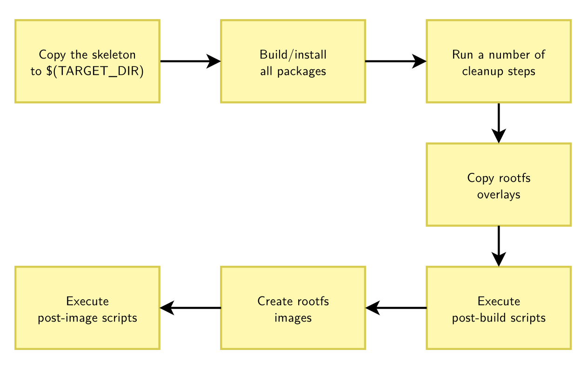
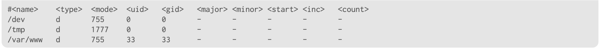

# 7. Root filesystem in Buildroot

## Rootfs construction steps



## Rootfs construction steps - root file skeleton


- the base of a linux root filesystem consist of:
    - UNIX directory heirarchy
    - few configuration files and scripts in `/etc`
    - no programs or libraries
- The first step of creating the rootfs image is to paste the skeleton root filesystem to the 
- buildroot has some default root filesystems depending on the init system being used, but you can also add a custom skeleton.
    - if you choose one for a specific init system, build root will add the files specific to the root filesystem.

**a custom skeleton rootfs is not recommended, and the defaults are adequate**.

## Rootfs construction steps - installation of packages


- here, all the target packages are built (BusyBox, Qt, OpenSSH, etc.)
- The files will go into the $(TARGET_DIR): programs, libraries, fonts, data files, etc.
- most of the files in the root filesystem are here.

## Rootfs construction step - cleanup


- Once you install all packages, you clean up unecessary files to reduce the size of the filesystem.
    - This includes things like using strip to remove unneeded debug info, removing heeader files, static libraries, etc.

## Rootfs construction step - root filesystem overlay


- This lets you customize the contenst of your root filesystem:
    - add configuration files, scripts, links, directories, etc.

- The root filesystem overlay will copy over file from the source to the root filesystem, overwriting files as needed.

## Rootfs construction step - Post build scripts


- the final step is the post-build script
- sometimes, using a root filesystem overlay isn't adequate, so you can implement a **post-build script**
- this will let you customize existing files, remove unneeded files and create new files dynamically.
- You can write it in whatever you want (shell script is the norm).
- You can set the postbuild script using `BR2_ROOTFS_POST_BUILD_SCRIPT`

## generate filesystem image - fakeroot scripts

- Buildroot lets you define the filesystem image format to generate.
    - internally, buildroot creates a script that:
        - changes the owner of all files to root.
        - runs the filesystem image generation utility
    - The script is ran using a tool known as fakeroot.
        - It immitates being root, so you can modify permissions and ownership, create device files, etc.
    
- If you want to make a fakeroot script, you can define it in the `BR2_ROOTFS_POST_FAKEROOT_SCRIPT`

## permission tables

- you can define the permissions of files using a **permission table**
- `BR2_ROOTFS_DEVICE_TABLE` defines a list of permission table files



- you can see the: name, type (c,d,f, etc.), execution mode, uid, gid, major/minor number, etc.

## device table

- these are similar to permission tables, but meant for devices.

## user table

- these contain information about UNIX users and groups
- `BR2_ROOTFS_USERS_TABLES` is a space-separated list of user tables
- this has the username, uid/gid, password, hom directory, shell, groups and addition comments.

```
<username>  <uid>   <group>  <gid>   <password>    <home>  <shell>    <groups>    <comment>
    foo      -1       bar     -1      password   /home/foo /bin/sh   alpha,wheel   franny
``` 

## post image scripts

- Once the filesystem image is created, it runs a **post-image** script.
    - this is at the very end of buildroot.
- Here, it does custom actions, like:
    - extracting the root filesystem to the SD card.
    - moving files
    - generate final firmware image.

- You can define postimage script using `BR2_ROOTFS_POST_IMAGE_SCRIPT`

## Init mechanisms

- Buildroot supports multiple init implementations:
    - busybox
    - sysvinit
    - systemd
   - openrc


## managing `/dev`

- there are four approaches:
    - `devtmpfs`: creates device files automatically. Default option
    - static `/dev`: statically created /dev files, not practical
    - `mdev` part of busybox, runs custom actions when added/removed
        - requires devtmpfs kernel support
    - `eudev`: allows to run custom action
        - again, requires devtmpfs support

- When you use systemd, `udev` is the only option.

## Deploying buildroot image

- Bulidroot will simply store the image in `$(O)/images`
- You need to upload those images to the target device

- Solutions for removable storage:
    - manually create partitions and extract rootfs as tarball to appropriate partition
    - use tool like **genimage** to create complete image of the media, including partition.
- solutions for nand flash: transfer image to target, then flash.
- **NFS booting**
- initramfs

## deploying buildroot image - genimage

- this will create a full image of a block device (Including multiple partitions and filesystems)
- there's a script, genimage.sh which can be used as a post-image script.
- You'd make a config file, and define what partitions look like, and what files to move.

## NSF booting

- this will generate a tarball of the root filesystem, which you'll then extract to your root partition.

## initramfs

- this means the root filesytem is fully in ram.
    - made for small filesystems, allows for fast booting or kernel development.

- the two solutions are:
    - create a cpio archive, so you can load the rootfs from the bootloader next to the kernel image.
    - embed the initramfs in the kernel image.

