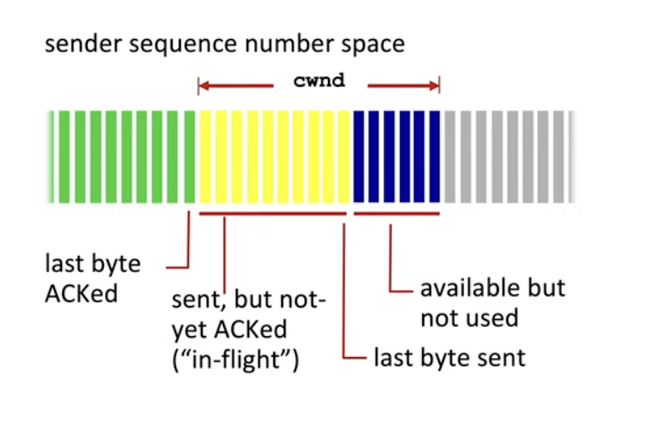
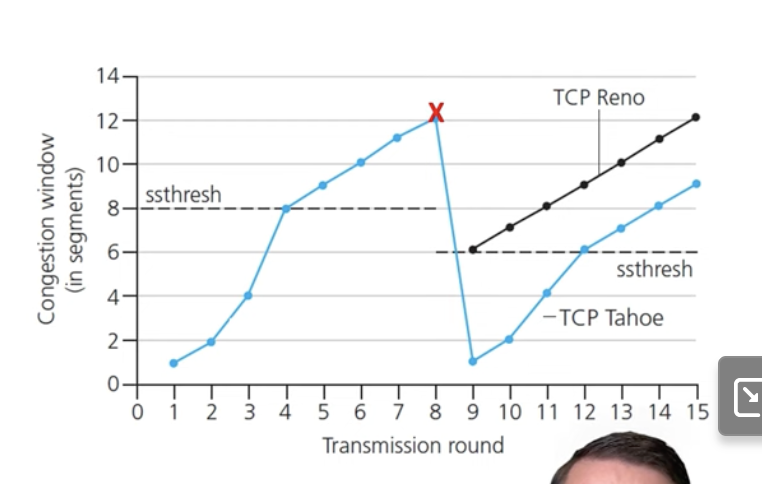
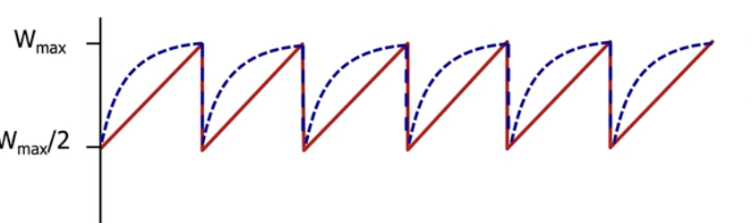
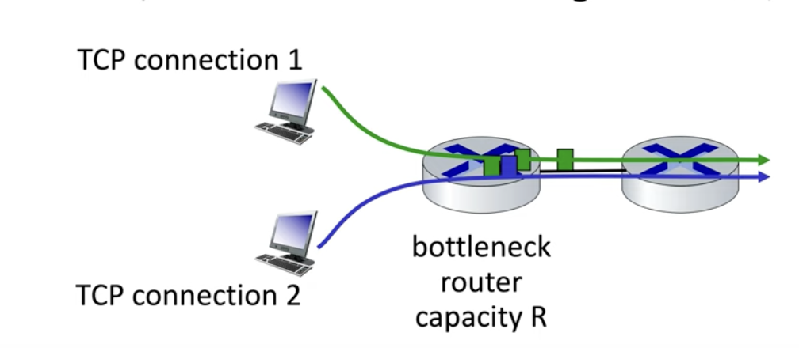
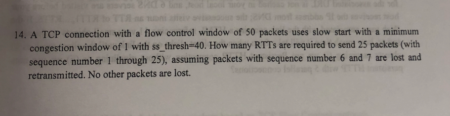

# Midtern practice

## Approaches to Congestion

- End-end congestion control:
    - We infer the lost from observed loss and delay
    - Used by TCP
- Network-assisted congestion control:
    - Network provides feedback.
    - Implemented by DecBIT protocols, but too complex for network stack.

## AIMD

- Additive increase, multiplicative decrease
    - Here, we increase the sending rate until there's packet loss.
    - Once packet loss occurs, decrease the sending rate on loss event.

- Additive increase, means to increase the sending rate by 1 Maximum segment size every RTT until loss is detected
- Multiplicative Decrease says to cut the sending rate in half at each los event.
    - Older versions would just restart the sending rate back to one.

## Congestion Window

- Congestion window (cwnd) tells us how much data a sender can transmit to the network before receiving an acknowledgement.
    - Last byte sent - last byte acknowledged <= congestion window
- TCP rate approx (cwnd / RTT) bytes per second

## TCP Slow Start

- Initially, TCP will send 1 MSS.
    - We double the cwnd every RTT.
    - It ramps up exponentially fast.
        - We switch from exponential to linear when we reach the **sshthresh**

## sshtresh

- SSH Threshhold: This is half the size of the congestion window.
    - On a loss event, we cut the sshthresh to half of the congestion window.

## TCP CUBIC

- TCP Cubic is the version of TCP linux uses
- There's some consistency with the sending rate where loss is experienced (known as Wmax).
    - TCP Cubic will maintain at Wmax, such that when loss happens, the sending rate will decrease, but TCP will ramp the sending rate towards Wmax, but approach Wmax more slowly.

- We can see here, we Wmax more slowly.
- Wmax can increase overtime as well.

## Delayed based TCP Congestion Control

- We want to keep bottleneck links busy, but avoid high delays and buffering.

- Delay based approach:
    - RTTmin - minimum observed RTT (uncongested path)
    - We can have uncongested throughput with congestion window cwnd/rttmin

- The measured throughput = bytes sent in last RTT interval / RTT measured
    - If we send too many bytes, it increases the RTT as well, we don't want that.
    - We change the sending rate linearly.

- This approach forcing packet loss, and maximizes throughput while keeping the delay low.

## Explicit Congestion Notification

- We get help from the network layer for congestion control.
    - This is only if the network supports it

## TCP Fairness
- There is an aspect of performance, but there's also fairness:
    - Given K connections and a bandwidth R, the average rate should be R / K

## Answer

%

- We have 50 packets, with a ss_threshold of 40, and we want to send 25 packets.

|iteration |description|
| --- | --- |
| 1 | we send 1 packet (containing 1), it succeeds |
| 2 | we send 2 packets (containing 2 and 3), succeeds |
| 3 | we send 4 packets (containing 4, 5, 6 and 7), but we lose the packet 6 and 7. We need to cut the congestion window by half to 2, we also change the ss_thresh to 2. |
| 4 | we send 2 packets (6 and 7). Since we're at the threshold, we increase the rate linearly |
| 5 | we send 3 packets (8, 9 and 10) |
| 6 | we send 4 packets (11, 12, 13 and 14) |
| 7 | we send 5 packets (15, 16, 17, 18, 19)|
| 8 | We finally send 6 packets (20, 21, 22, 23, 24, 25) |
